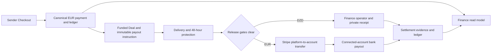

# ShipTrip Phase 8F-H0 — Multi-currency payout architecture & internal Finance control plane

**Architecture decision record · 7 September 2026**

H1 implementation status (8 September 2026): dormant domain, snapshot, profile,
encryption and permission foundations are implemented and locally validated.
See [H1 developer notes](PHASE8F_H1_PAYOUT_FOUNDATIONS.md). H2–H8 and
all external enablement gates remain pending; the H0 decisions below are retained.

Repository baseline: `94aad9be50960f47cc73b47033a704effc4101b8`. The pre-existing, uncommitted G3 entry in `IMPLEMENTATION_STATUS.md` is preserved. H0 changes documentation only. No application code, migration, provider mutation, deployment, email activation, or Railway configuration change is authorized by this document.

The user's H0 decisions extend the authoritative [V1 specification](SHIPTRIP_V1_SPEC.md). This document distinguishes observed behavior, decisions for implementation, and external launch gates. Recommendations below are instructions for later phases, **not instructions to change external settings now**. Journey early-arrival/arrival anti-abuse design is excluded.

## 1. Current architecture and verification evidence

### Repository evidence personally inspected

Paths below are relative to `backend/monolith/` unless stated otherwise.

| Evidence | Observed behavior |
|---|---|
| `apps/finance/models.py` | `PaymentOrder` is an EUR obligation; `PaymentAttempt` records actual provider currency, exponent, FX micros, settings revision, snapshot time, provider refs and idempotency. `Payout` is one-to-one with Deal. `TravelerPayoutMethod` already exists. |
| `apps/finance/services.py::_fund_deal_if_covered` | Creates the traveler payable, allocates marketplace/Boost platform shares, and creates the payout at funding. Calls method resolution with `query_provider_capability=False`. |
| `services.py::_funding_provider`, `resolve_payout_method` | Funding-provider helper chooses latest applied successful balance attempt by `succeeded_at, id`. The resolver currently does not use its `funding_provider` argument to route money. Disabled automation, absent capability, and deferred capability checks all select manual settlement. |
| `apps/finance/providers/stripe.py` | Direct REST adapter using `requests`, not Stripe SDK. EUR Checkout, per-session `adaptive_pricing[enabled]=false`, refunds, signature verification and connected-account capability lookup. No account onboarding, transfer execution or bank-payout execution in this adapter. |
| `apps/finance/providers/chargily.py` | TEST/live key and URL agreement; DZD checkout; HMAC with merchant secret; refunds are manual in the implemented contract. No traveler disbursement API integration. |
| `apps/finance/payout_release.py` | Checks confirmed delivery, stored protection deadline, active dispute and balance/refund state under `lock_deal_lifecycle`. Makes payout eligible and completes the delivery contract. Completing a Deal does **not** prove the traveler was paid. |
| `apps/finance/services.py::complete_manual_payout` | Locks only Payout; accepts operator-selected currency, amount and FX; reference required, receipt URL optional; immediately records `paid` and discharges payable. It does not enforce an immutable destination/settlement quote. |
| `apps/finance/settlement.py` | One cancellation/dispute settlement engine; includes deposit credit and bound Boost orders. Only a `paid` Payout counts as externally paid money today. Reallocation can change payout amount. |
| `apps/finance/ledger.py`, `models.py::LedgerAccount` | Append-only signed EUR double entry: provider clearing, sender deposit, Deal funds, traveler payable, platform commission. Commission is allocated at funding, although its current account label says revenue. |
| `apps/core/financial_locks.py` | Canonical aggregate lock order; `FOR NO KEY UPDATE` avoids deferred-FK lock cycles. Provider I/O outside financial transactions. |
| `apps/finance/jobs.py`, `operations.py` | PostgreSQL `ScheduledJob`, leases/recovery, `JobDeferred`, permanent/retryable errors, G1 operational resolution distinct from financial outcome. |
| `apps/admin_panel/permissions.py`, `console_*`, `ops_serializers.py` | Capability-gated Finance queues/detail/ledger. Finance cannot view generic private KYC/dispute evidence. Existing form offers currency, amount, reference, optional URL and confirmation. |
| `apps/core/storage.py` | Logical storage classes and credential ownership. Parcel/proof/dispute currently share generic private media; KYC has a separate bucket/credential. Signing alone does not prove readability. |
| `apps/kyc/models.py`, `apps/accounts/models.py` | Approved KYC submissions reference documents and reviewer, but contain no verified structured legal first/last-name fields. `User.full_name` is not a verified identity assertion. |
| `apps/notifications/outbox.py`, `models.py`, `push.py`, `apps/core/redis_bus.py` | Durable email rows and generic payout event exist. Disabled email dispatch leaves obligation intact. Generic Redis publisher creates notification rows in an `on_commit` callback; a commit/crash gap remains for new critical payout notifications. |
| `mobile/lib/features/profile/payouts_screen.dart`, `domain/payment.dart`, `features/deals/deal_screen.dart` | Earnings/history and payout labels exist, but no complete EUR/DZD method configuration flow. Existing countdown uses `eligible_at`; H phases must expose the actual protection deadline separately. |
| `.github/workflows/ci.yml`, `backend/contracts/sql/` | PostgreSQL migration/schema-drift gates exist. CI explicitly reports sqlc generation skipped while query directories are empty; Go currently also uses raw pgxpool. Do not claim generated repositories were updated when the gate skipped them. |

The graph report is dated 24 August and references `59944c83`; it predates the finance work inspected here and was not treated as current evidence. No graph rebuild is needed for H0.

### Read-only external observations on 7 September

Inspected Railway service `shiptrip` in its environment named `production`; that environment currently runs **TEST payment rails**. Read provider APIs using the existing server credentials, without creating anything.

| Surface | Observed fact |
|---|---|
| Railway | Stripe TEST key; Chargily TEST key and `https://pay.chargily.net/test/api/v2`; `EMAIL_ENABLED=false`; mock and legacy payment mutation switches false. |
| Stripe platform `GET /v1/account` | `acct_1TLWM93aixfgmaTz`, country `FR`, default currency `eur`, account type `standard`; `charges_enabled=false`, `payouts_enabled=false`, empty capabilities. This is the **platform** object's current response, not a connected-account type decision. |
| Stripe connected accounts | `GET /v1/accounts?limit=1` returned no accounts and `has_more=false`. This does not prove Connect platform registration/terms are complete or incomplete. |
| Stripe webhook registry | One enabled TEST endpoint: `https://shiptrip-production.up.railway.app/api/payments/webhooks/stripe`; endpoint API version `2026-03-25.dahlia`; exact five current events listed in section 10. |
| Stripe API-version env | `STRIPE_API_VERSION` is empty. Outbound requests currently inherit the account default; the webhook's pinned version does not pin API requests. |
| Latest Stripe checkout | Complete/paid, `livemode=false`, currency EUR, Adaptive Pricing disabled. This verifies a session, not every Dashboard toggle. |
| Stripe TEST balance | EUR available 0 cents, pending 6,824 cents. Platform payout schedule daily, delay 7 days. This is provider state, not a liability/revenue statement. |
| Chargily TEST checkouts | Authenticated list succeeded; two checkouts, latest returned checkout paid in DZD. No new checkout/payment was made. |
| Chargily balance | `GET /balance` succeeded, `livemode=false`: DZD balance 1,857, ready for payout `0.00`, on hold 1,857; EUR/USD zero. These are provider-reported wallet values. |
| Storage config | Parcel/proof/dispute map to one media bucket; KYC maps to a distinct bucket. No payout-specific bucket/key configured. |

No Stripe/Chargily Dashboard UI session, live bank transfer, production approval, individual traveler eligibility or end-to-end Connect workflow was verified. G3's historical €60 QA payout is documentation evidence, not a newly queried database result. It must remain unpaid unless an actual TEST settlement is deliberately recorded in a later authorized phase.

## 2. Gaps that implementation must close

1. Profile preferences, provider readiness and immutable payout instructions are currently conflated; an outage currently causes manual method selection.
2. No hosted Stripe onboarding or separate transfer/bank-payout execution. `provider_payout_id` alone cannot represent both.
3. Manual amount/FX/reference entry can disagree with obligation; receipt is optional and URL-based.
4. No versioned CCP/RIP profile, name-consistency attestation, dedicated sensitive-data permissions or payout evidence storage.
5. Existing refund/settlement/freeze logic assumes un-paid means money still recoverable. That is unsafe once an external transfer is attempted.
6. Existing ledger commission allocation is earlier than earned revenue; provider clearing is a canonical control account, not reconciled physical treasury.
7. No mode isolation on all existing financial rows, multi-provider provenance allocation, dispatch reservation, bank-payout attempt history, or finance read model with precise temporal semantics.
8. Existing protection/release logic is useful but checks primarily the balance order. New execution must also cover linked deposit, Boost, provider disputes, fraud and refund reservations.
9. Email event reuse needs state-specific copy and durable notification intent; mobile needs setup/deferred/sent/returned states.

## 3. Final architecture decisions

**Retain Django finance as the single authority.** Extend existing Payout, method, provider-event, ledger and ScheduledJob foundations. No second payout system in Go, Flutter, Stripe metadata or an owner spreadsheet.

| Decision | Locked implementation rule |
|---|---|
| Canonical obligation | EUR cents, including protected traveler Boost bonus. Provider/operator charges do not reduce agreed earnings. |
| Rails | `Payout.method=manual` + DZD; `stripe_transfer` + EUR. Keep existing machine names; label Stripe method “Stripe EUR payout” in product UI. |
| Preferences | Enabled EUR, DZD or both; readiness is separate from enabled preference. |
| Snapshot | Funding transaction freezes routing policy, selected method version and payout FX. Later changes cannot silently reroute/reprice it. |
| EUR product | Stripe Connect, Accounts v1 **controller properties**, Express Dashboard, Stripe-hosted onboarding, separate charges and transfers, then platform-initiated standard bank payouts. |
| EUR automation | ShipTrip worker initiates eligible work; connected-account Stripe schedule is `manual` so the worker controls exact disbursements. “Manual” here describes an API scheduling mode, not an admin-click product flow. |
| Geography | Initial Stripe connected-account country allowlist `FR,DE,ES`, subject to actual provider eligibility and EUR bank readiness. Nationality alone is not the test. `DZ` excluded. Expansion is configuration plus verified country tests, not inference. |
| Cross-provider funding | No assumption that Chargily cash is Stripe available balance. Non-Stripe-backed EUR payouts are capability-gated and disabled by default; details in section 8. |
| DZD execution | Approved immutable CCP/RIP profile, exact frozen amount, claimed operator workflow, uploaded private receipt and explicit completed-transfer confirmation. |
| Earned revenue | Recognize at clean protection expiry or an authoritative final settlement outcome, not at funding or merely on bank payout. |
| Delivery completion | Preserve existing Deal completion at contractual close. Traveler payout remains a separate visible lifecycle. |
| Fees/rounding | ShipTrip bears payout/provider costs; no hidden traveler deductions. DZD whole-dinar rounding uses the same exact ceiling rule as current conversion. |

## 4. Canonical money and accounting rules

Let `E` be current authorized traveler earnings in EUR cents, `R` frozen DZD-per-EUR micros.

- EUR settlement: amount `E`, exponent 2; no FX.
- DZD settlement: `ceil(E × R / 100,000,000)` whole dinars, exponent 0. Store integer result and the inputs. Never use float or convert a formatted string.
- Example: `E=6000`, `R=260000000` gives EUR 60.00 and DZD 15,600.
- DZD exponent 0 is ShipTrip's **whole-dinar settlement convention**, not a statement that ISO DZD has no minor unit. A provider balance field may contain decimal dinars; parse that contract independently.
- Store rounding policy `ceil_whole_dzd_v1`; never recompute past cash settlement from a new rate. DZD rounding variance belongs to ShipTrip, not traveler revenue or an inflated EUR liability.
- Payout fees, bank fees charged to ShipTrip, Connect costs and chargeback costs are platform expenses. Do not deduct them from `E`. Production gate must confirm the offered bank rail can instruct the promised EUR amount without an undisclosed platform deduction; bank-side fees are not silently modeled as paid earnings.
- An authoritative cancellation/dispute settlement may change the amount owed. Record an append-only amount revision with old/new EUR and settlement amounts, settlement decision and ledger transaction. This is an explicit economic adjustment, not a profile or FX change. Use the original rate for the revised obligation and compute the **total revised amount**, not the sum of independently rounded fragments.
- Once a transfer is committed or its outcome unknown, no downward amount revision or refund may reuse that money. Reconcile/reverse/recover first.
- Zero traveler award cancels the obligation with reason and ledger adjustment. Preserve the original positive funded amount, but allow the current authorized `amount_eur_cents` to be zero **only for cancelled versioned payouts**, with an explicit zero amount revision. Replace the current unconditional positive-current-amount constraint in the staged constraint migration. Do not create a zero-value provider payout.

## 5. DZD manual payout flow

1. Traveler submits profile and photo. Profile can be enabled while review is pending; that is not execution readiness.
2. Funding freezes DZD method/version, holder evidence revision and FX; payout starts `not_eligible`.
3. At release, missing/rejected review becomes `blocked` with a clear correction reason; approved profile becomes `eligible`, sublabel “Awaiting operator transfer.”
4. Finance queue shows Traveler, Deal, canonical EUR, FX/rate revision, exact DZD to send, holder name, masked CCP/RIP and “View payout account document.” No summary-page evidence thumbnails.
5. Finance operator opens detail and claims **Prepare transfer**. A single active manual attempt owns the obligation. The instruction is server-generated and version-bound; amount/currency/FX are read-only.
6. Immediately before making the transfer, operator confirms **Begin external transfer**. Server rechecks all gates and atomically marks the attempt externally committed/processing. Another operator cannot claim or pay it. No automatic lease expiry makes it payable again.
7. Operator transfers externally, uploads JPEG/PNG/WebP receipt, optionally supplies transaction/reference number, and confirms that the displayed exact transfer completed. A bank submission/pending screen supports `sent` only; a completed-transfer receipt plus explicit attestation supports `paid`.
8. A completed receipt command records `sent` and `paid` events in one transaction where appropriate. Preserve both timestamps and the operator attestation; this is **operator-attested settlement**, not independent bank verification. Coalesce immediate push/email to paid rather than two nearly simultaneous messages.
9. A pending receipt leaves `sent`, then **Confirm settled** requires completed evidence and confirmation. No timer marks it paid. Failed/unknown external transfer remains a recovery case; operator must establish non-execution/return before any new transfer instruction.

Required stored facts: attempt, instruction version, actual amount/currency, transfer-start authorization, sent/settled/recorded times, operator, uploaded receipt/evidence ID and digest, optional external reference, confirmation version and audit event. Generate an internal receipt reference even if external reference is blank. A receipt is mandatory for new DZD `paid` rows; never substitute a free-text reference.

An amount mismatch blocks the normal completion command and opens an exception: record what actually happened privately, keep unsettled remainder/overpayment recovery visible, and require a Finance/Super Admin adjustment. Never edit the obligation to make a mistaken transfer appear correct. Bulk settlement is out of scope.

## 6. EUR Stripe execution flow

1. Authenticated traveler enables EUR and declares their actual account/business country. Backend checks allowlist and current KYC, creates one provider account under the platform, and records only safe identifiers/readiness. Stripe collects legal/provider requirements and bank details.
2. Backend issues short-lived hosted Account Link; mobile opens system browser. Return merely triggers retrieval; it never marks ready. Expired links require authenticated refresh.
3. Ready means: verified owning platform/mode/account; eligible country; `capabilities.transfers=active`; `payouts_enabled=true`; acceptable requirements/disabled reason; an eligible EUR external bank account; expected platform controller settings and manual payout schedule. `details_submitted` alone is insufficient. `charges_enabled` is not an independent seller gate when no seller card-payment capability is requested.
4. After delivery/protection, worker revalidates domain gates and fresh provider readiness. It reserves the obligation before any external request.
5. Record a source allocation, then create platform Transfer(s) in EUR to the frozen connected account. Normal Stripe-funded flow links each source to its successful `ch_` charge using `source_transaction` and a Deal/payout transfer group. Never pass a `pi_` PaymentIntent ID as a Charge ID. Only successful, reconciled, eligible card-funded sources are automated initially; unsupported asynchronous sources defer/review.
6. Retrieve connected-account available balance with `Stripe-Account`. Only once allocated transferred funds are available, create `POST /v1/payouts` on that account, currency EUR, method `standard`, exact allocated amount, eligible bank destination ID. That is a distinct provider operation with its own idempotency key and `po_` reference.
7. Pending bank payout is `processing`; provider `in_transit` is `sent`; provider `paid` is `paid`. Webhooks and polling converge through the same reconciler.
8. Bank failure returns money to the connected-account balance, not necessarily the platform. Fix onboarding/bank destination through Stripe; retry the **bank payout only**, after return evidence and reservation reconciliation. Never create the platform transfer again because a bank payout failed.

Use application-created standard disbursements with explicit local allocation. Default one disbursement per Payout. If an adjusted award is below Stripe's minimum, accumulate ready obligations for that same traveler/account/mode/currency until the minimum is reached; a `StripeDisbursement` plus allocation rows models this precisely. No mixing travelers and no batching disputed or blocked work. Aging small balances become a Finance exception after seven days; never forfeit or round up the canonical award. France's published minimum is EUR 1; configure/test DE/ES similarly. A lone sub-minimum balance requires an approved settlement remedy, not a fictitious payout. [Stripe payout minimums](https://docs.stripe.com/payouts)

## 7. Stripe product choice, API contract and alternatives

Choose Connect and separate charges/transfers because ShipTrip already charges on the platform and must withhold release until a later delivery outcome. Keep customer Checkout behavior. Destination charges move funds to the recipient at charge time and would require reversal management during protection. Direct charges change merchant/charge ownership. Neither is selected. Stripe distinguishes platform Transfers from bank Payouts; separate-charge refunds do not automatically undo transfers. [Separate charges and transfers](https://docs.stripe.com/connect/separate-charges-and-transfers)

Use Accounts v1 with explicit controller properties:

| Parameter | Value |
|---|---|
| `controller.stripe_dashboard.type` | `express` |
| `controller.requirement_collection` | `stripe` |
| `controller.fees.payer` | `application` |
| `controller.losses.payments` | `application` |
| `capabilities[transfers][requested]` | true |
| `country` | Verified supported account country; never forced FR for a DZ resident |
| `default_currency` | `eur` |
| Service agreement | Full agreement collected/accepted through Stripe-hosted onboarding |
| Account payout schedule | `settings.payouts.schedule.interval=manual` using v1 Accounts |

Do not rely on the deprecated shorthand `type=express`, request unnecessary `card_payments`, or use Standard OAuth. The Express Dashboard behavior and platform loss/fee responsibilities are intentional. Stripe documents this controller configuration independently of the legacy type shorthand. [Controller properties](https://docs.stripe.com/connect/migrate-to-controller-properties)

**Pin new Connect adapter and both event destinations to `2026-03-25.dahlia`**, the stable webhook version already observed. Verify all used v1 fields against that version in H2. Do not change existing payment API version as an incidental refactor. A version incompatibility blocks that contract test and requires a documented version amendment; do not silently switch APIs.

Exact provider surface for the selected flow (server only):

| API | Required use |
|---|---|
| `GET /v1/account` | Assert configured platform ID/country and credential mode context. |
| `POST /v1/accounts` | Controller parameters above, real allowed country, `business_type=individual` for V1 personal traveler, EUR default, transfers requested, safe internal method UUID metadata. Stripe owns identity/bank collection. |
| `GET /v1/accounts/{acct}` | Read current readiness/controller/schedule with minimized persistence. |
| `POST /v1/accounts/{acct}` | Provision/repair expected v1 payout schedule through an audited configuration operation; never in H0. |
| `POST /v1/account_links` | `account`, `type=account_onboarding`, server-owned return/refresh URLs with signed state. No traveler-controlled redirect. |
| `POST /v1/accounts/{acct}/login_links` | Short-lived authenticated Express Dashboard access; never stored in history. |
| `GET /v1/payment_intents/{pi}` and `GET /v1/charges/{ch}` | Resolve/verify successful source Charge, amount/currency/mode and balance transaction. |
| `POST /v1/transfers` | `amount`, `currency=eur`, `destination=acct`, `source_transaction=ch` for eligible card source, `transfer_group`, safe operation metadata, operation idempotency header. No `on_behalf_of`, destination-charge `transfer_data`, or `application_fee_amount`. |
| `GET /v1/transfers/{tr}` and `GET /v1/transfers` | Transfer outcome/reversal and ambiguous-create recovery in platform scope. |
| `GET /v1/balance` | Platform or explicit connected-account scope; never infer connected availability from platform balance. |
| `POST /v1/payouts` | Connected-account header; exact allocated cents, `currency=eur`, `method=standard`, `destination=ba`, safe operation metadata and independent idempotency key. |
| `GET /v1/payouts/{po}` and `GET /v1/payouts` | Same connected-account scope, current status/return and ambiguous-create recovery. |
| `POST /v1/payouts/{po}/cancel` | Connected scope; only a still-pending application-created payout, with durable operation. No promised cancellation after in transit. |
| `POST /v1/transfers/{tr}/reversals` | Platform scope; reviewed exact reversal amount after checking recoverable connected funds; reconcile return before releasing reservations. |
| `GET /v1/balance_transactions/{txn}` / list | Authoritative cash/fee/return reconciliation, using object's owning account scope. |

The adapter remains a thin REST boundary with explicit account header, finite timeout, request ID capture and safe typed results. It never decides earnings or release eligibility. [Transfer API](https://docs.stripe.com/api/transfers/create), [Payout cancellation contract](https://docs.stripe.com/api/payouts/cancel)

Accounts v2 was evaluated. The currently served official overview demonstrates `2026-08-26.preview` and different configurations/event semantics. This does not establish that every v2 feature is preview-only; it does mean H0 has no reason to make the new money flow depend on that preview contract. Select supported v1 controller APIs for this phase and isolate the adapter so a deliberate future migration is possible. No dual v1/v2 account authority. [Accounts v2 overview](https://docs.stripe.com/connect/accounts-v2), [v1 account creation](https://docs.stripe.com/api/accounts/create?api-version=2026-03-25.dahlia)

Not selected: Global Payouts, Treasury, Issuing, Financial Connections as a required separate integration, Instant Payouts, stablecoin payouts, destination-charge application fees, funds-segregation preview or a raw-bank-details form. Stripe's current Global Payouts material lists US/UK sending platforms, so it is not the baseline for this France entity. [Cross-border product comparison](https://docs.stripe.com/connect/cross-border-payouts), [Global Payouts](https://docs.stripe.com/global-payouts)

## 8. Country limits, cross-provider money and fallback

Algeria is outside Stripe's documented self-serve Connect cross-border regions. A French platform cannot assume it can create a DZ receiving account and pay EUR simply because the traveler has an IBAN or an Algerian card can pay a Stripe Checkout. Country support, legal account eligibility and EUR bank settlement are separate gates. A traveler of Algerian nationality with a legitimately eligible FR/DE/ES account may qualify through Stripe's checks; the app must never suggest false residency. [Stripe cross-border availability](https://docs.stripe.com/connect/cross-border-payouts)

| Enabled preferences at funding | Stripe balance funding source | Chargily balance funding source |
|---|---|---|
| DZD only | Manual DZD at frozen business FX; treasury supplies DZD | Manual DZD at the designated Chargily FX snapshot |
| EUR only, eligible country | Stripe EUR, subject to funding-source and liquidity checks | EUR obligation remains EUR; capability-gated non-Stripe funding required |
| Both, eligible Stripe country | Stripe EUR | Manual DZD |
| EUR impossible for declared country | Do not enable EUR; explain unsupported country and offer DZD setup | Same |
| Neither enabled | New acceptance/funding flow requires an explicit payout preference; legacy obligations are blocked for setup, never lost | Same |

Readiness pending is different from geographic impossibility: EUR can be enabled in a supported country before onboarding finishes. Do not route such payouts to DZD because Stripe is slow/unavailable. “Both” always uses the locked mapping; do not quietly reinterpret it as “whichever works.” For an unsupported account, traveler explicitly selects DZD-only for future Deals. Existing funded EUR instructions do not automatically fall back; any exceptional currency change requires a later separately authorized product/legal decision and append-only settlement amendment. V1 routine recovery supports same-rail destination correction only.

**Material external blocker: Chargily-funded EUR.** Stripe's top-up documentation lists EU availability as private preview, while the cross-border product comparison distinguishes multi-processor payout use cases. A successful Stripe TEST transfer from pooled balance does not prove permission to use Connect as a general payout service for Chargily receipts. [Stripe platform top-ups](https://docs.stripe.com/connect/top-ups)

Baseline V1 therefore uses only eligible Stripe-backed source allocations for automatic EUR. It may not borrow another traveler's earmarked money. `STRIPE_CONNECT_NON_STRIPE_FUNDING_ENABLED=false` stays false unless Stripe explicitly approves the France platform's multi-processor funds flow and provides an available funding facility. No top-up API implementation is required in H1–H7; isolate as H8 optional work.

For **new** Deals whose preferences/source composition necessarily require unsupported non-Stripe EUR funding, prevent the incompatible payment before collecting it; offer Stripe funding or traveler-configured DZD where the routing rule permits it. Deposit/Boost provenance must be checked before balance checkout. If late captures or legacy data create the obligation anyway, preserve EUR and show `blocked/funding_route_unavailable`; Finance must arrange an approved remedy. Do not claim the complete EUR-only × Chargily combination is production-ready while this gate is closed. The locked product goal is retained; external enablement is unresolved.

DZD-only + Stripe funding is a treasury problem too: ShipTrip must fund its authorized DZD paying account through a lawful operational route. Stripe does not convert/remit to CCP for this design. Provider cash, FX margin and operating bank liquidity remain separately reconciled. Owner confirmation of the France/Algeria operating settlement arrangement is a production gate.

## 9. Exact external setup checklist

Classification indicates the earliest required gate. **No owner action is requested during H0.** “Testing” here means external integrated TEST, not local unit tests.

| External action | Classification | Who / exact outcome |
|---|---|---|
| Any Stripe/Railway change to start schema/domain coding | **NOT REQUIRED** | H1 can proceed against contracts with features off. There are no external actions REQUIRED BEFORE CODING. |
| Activate/configure Connect in TEST; complete any platform profile/terms presented | **REQUIRED BEFORE TESTING** | Owner or authorized Stripe administrator; confirm platform can create selected controller accounts. Empty account list does not prove this is done. |
| Select platform business model/loss and fee responsibility | **REQUIRED BEFORE TESTING** | Owner confirms marketplace, platform charge ownership, Express Dashboard, Stripe requirement collection, platform losses/fees. Match section 7. |
| Hosted onboarding branding, support/business URLs, external bank collection, country configuration | **REQUIRED BEFORE TESTING** | Stripe administrator; configure FR first, then DE/ES tested individually. Enable Stripe-hosted bank collection; no ShipTrip IBAN form. |
| New connected-account TEST webhook destination | **REQUIRED BEFORE TESTING** | Implement route first, then register Connected accounts scope, exact section 10 list and independent secret. |
| Extend existing platform TEST destination event selection | **REQUIRED BEFORE TESTING** | Only after new dispatch/parser exists; retain all five payment events. No broad all-events subscription. |
| TEST env additions and storage provisioning | **REQUIRED BEFORE TESTING** | Authorized Railway/storage operator; section 11. Local tests use isolated local keys/storage. |
| Configure connected-account schedule | **REQUIRED BEFORE TESTING** | Backend account provisioning sets manual; verify using GET. Owner checks any Dashboard self-service payout controls cannot defeat application accounting. |
| Platform balance retention policy | **REQUIRED BEFORE TESTING** | Test platform schedule/manual reserve policy without enabling payments; reproduce available-balance delays. Production currently daily is unsuitable for assuming reserve retention. |
| Live platform verification, charge/payout activation and Connect approval/agreements | **REQUIRED BEFORE PRODUCTION ENABLEMENT** | Owner supplies legal/business details and accepts applicable terms. Current response is not ready. |
| Confirm delivery-marketplace and France/Algeria funds-flow approval, fees/loss responsibility and retention limits | **REQUIRED BEFORE PRODUCTION ENABLEMENT** | Owner with Stripe/qualified advisers. No external contact sent by H0. |
| Live bank/treasury readiness, refund reserve and DZD paying account | **REQUIRED BEFORE PRODUCTION ENABLEMENT** | Owner/Finance; independently reconcile real liquidity. |
| Live webhook destinations, signing secrets, live key and platform ID assertion | **REQUIRED BEFORE PRODUCTION ENABLEMENT** | Operator, after deployed handlers and tested mode isolation; do not copy TEST account recipients into LIVE. |
| Non-Stripe-funded EUR permission/top-up preview | **REQUIRED BEFORE PRODUCTION ENABLEMENT**, only for that combination | Owner obtains written capability approval. Otherwise leave flag false and restrict incompatible new checkouts. Not a requirement for local coding or Stripe-backed EUR release. |
| Final country/bank eligibility, payout limits/holding periods and role/evidence retention approval | **REQUIRED BEFORE PRODUCTION ENABLEMENT** | Owner approves country evidence and retention schedule; setup one test per permitted country. |
| OAuth Connect client ID, redirect URI registration for OAuth, OAuth token storage | **NOT REQUIRED** | Chosen flow uses platform-created accounts + hosted Account Links, not OAuth. |
| Separate Connect API secret, publishable key in Flutter, Stripe.js/PaymentSheet changes | **NOT REQUIRED** | Reuse server Stripe credential; hosted browser flow. Restrict key permissions if using restricted keys. |
| Connect configuration ID / Account Session / embedded onboarding configuration | **NOT REQUIRED** | Not used by v1 hosted Account Links. |
| Destination charges, application-fee events, Treasury, Issuing, Global/Instant Payouts | **NOT REQUIRED** | Not selected. |
| Change Adaptive Pricing, Chargily TEST config or email launch | **NOT REQUIRED** | Preserve current setup. Email activation remains separate. |
| Rotate existing payment webhook secret merely to add events | **NOT REQUIRED** | Keep it; new Connect endpoint has a new independent secret. Rotation only for an actual security reason. |

## 10. Exact Stripe webhook changes

Two URLs, two scopes, two independent signing secrets; use snapshot v1 events. Keep existing `POST /api/payments/webhooks/stripe` for **Your account**. Add `POST /api/payments/webhooks/stripe-connect` for **Connected accounts**. Account-scoped objects must be retrieved with the corresponding `Stripe-Account`; inspect `livemode` before dispatch. [Connect webhook scopes](https://docs.stripe.com/connect/webhooks)

| Scope | Exact event selection | Handling |
|---|---|---|
| Platform, retain | `checkout.session.completed`, `checkout.session.async_payment_succeeded`, `checkout.session.async_payment_failed`, `checkout.session.expired`, `payment_intent.payment_failed` | Existing payment ingress/reconciliation. |
| Platform, add | `transfer.created`, `transfer.reversed` | Match durable transfer operation/source allocation; reconcile amount and reversals. Transfer creation is not bank payment. |
| Platform, add | `balance.available` | Wake liquidity-blocked work and refresh provider snapshot; polling remains necessary. |
| Platform, add | `refund.created`, `refund.updated`, `refund.failed` | Reconcile own refunds; unknown provider/Dashboard refund places affected source/Deal under hold and imports an audited external refund record. No double refund. |
| Platform, add | `charge.dispute.created`, `charge.dispute.updated`, `charge.dispute.closed`, `charge.dispute.funds_withdrawn`, `charge.dispute.funds_reinstated` | Provider dispute record/hold and cash reconciliation. Closed/won does not clear other ShipTrip holds. |
| Connected, add | `account.updated`, `capability.updated` | Refresh safe readiness and controller/schedule state; wake deferred obligations. |
| Connected, add | `account.external_account.created`, `account.external_account.updated`, `account.external_account.deleted` | Refresh EUR bank readiness; invalidate stale destination authorization, do not persist bank payload. |
| Connected, add | `payout.created`, `payout.updated`, `payout.paid`, `payout.failed`, `payout.canceled` | Reconcile disbursement and all allocated Payouts; detect unexpected Dashboard withdrawals. |
| Connected, add | `balance.available` | Wake bank-payout work awaiting transferred-fund availability. |

These are selected event types, not wildcard subscriptions. Stripe uses **`payout.canceled`**, one L. There is no Connect `transfer.paid` or `transfer.failed` event to wait for; transfer POST failure is an API outcome. `transfer.updated` is metadata/description change and is not needed. `payout.updated` covers in-transit state; do not invent `payout.sent`. `person.updated`, OAuth authorization/deauthorization, application-fee, instant-payout and v2 thin events are not required by this integration. [Stripe event catalog](https://docs.stripe.com/api/events/types)

Reconciliation rules:

- Extend `PaymentProviderEvent` rather than creating a competing receipt store. Add `provider_mode`, `provider_account_id`, `endpoint_scope`, `api_version`, `object_type`, `object_id`, nullable payout-operation/account/disbursement references. Economic uniqueness becomes `(provider, mode, account_scope, provider_event_id)` with legacy backfill preserving uniqueness.
- Signature verification on raw body, 512 KiB cap, 300-second tolerance, constant-time compare; separate secrets selected by route. 2xx only after event and durable processing job commit. Unknown verified objects are quarantined/ignored with reason; not trusted through metadata alone.
- Store an explicit safe allowlist: object IDs, amounts/currency, status, mode, event creation time, required readiness codes. Do not reuse the current broad scrubber for bank/account payloads. Never store the full bank-account object, Account Link, raw KYC or raw request body.
- Receipt processing is separate from domain application. Duplicate resumes unfinished processing; same event ID with conflicting normalized financial fields creates a security/reconciliation alert. A previously applied event cannot create another ledger effect.
- Fetch authoritative current object state for out-of-order status changes. Serialize reconciliation per provider object and use local observation generation/CAS so a slower stale GET cannot overwrite a later observation. Never order lifecycle solely by event arrival time.
- A genuine bank return may change `paid` to `failed`; preserve the paid event and append a compensating settlement entry. Unknown failures remain reserved until a return is established. [Stripe Payout states and return fields](https://docs.stripe.com/api/payouts/object)
- Subscriptions change only after consumers deploy. Test/live events are routed into matching mode records; mode mismatch never updates another mode's obligation. Live Connect may receive test events; valid wrong-mode events are durably classified, not endlessly rejected.
- Keep webhooks/reconciliation active when new onboarding or automatic initiation is switched off.

## 11. Exact Railway/environment additions

All names below are **proposed**, not current configuration. Django owns them. The combined Railway launcher, `backend/railway/start.py`, must avoid forwarding payout keys to unrelated Go children; its inherited child environment needs explicit filtering for the new secrets. New resources use local substitutes until external TEST setup is authorized.

| Variable | Default / required value | Gate and consumer |
|---|---|---|
| `PAYOUT_PROFILES_ENABLED` | `false` | TEST after profile APIs; gates new profile UI/writes. |
| `PAYOUT_DZD_EXECUTION_ENABLED` | `false` | TEST after audited receipt workflow; LIVE explicit enablement. |
| `STRIPE_CONNECT_ENABLED` | `false` | TEST after Connect registration/adapter; gates account/link creation. |
| `STRIPE_CONNECT_PAYOUTS_ENABLED` | `false` | TEST after full execution/recovery matrix; AND existing versioned `payments.payout.auto_stripe_enabled`. |
| `STRIPE_CONNECT_NON_STRIPE_FUNDING_ENABLED` | `false` | Optional future permission-gated path only; never enabled by baseline migrations. |
| `STRIPE_CONNECT_EXPECTED_MODE` | `test` for current deployment | Required before external TEST; `live` only with separate mode-safe activation. |
| `STRIPE_CONNECT_PLATFORM_ACCOUNT_ID` | Observed TEST platform ID from section 1 | Required before external TEST; server asserts retrieved account ownership. LIVE owner verifies correct account ID. |
| `STRIPE_CONNECT_API_VERSION` | `2026-03-25.dahlia` | New adapter only; version-pinned tests required. |
| `STRIPE_CONNECT_WEBHOOK_SECRET` | Secret for new Connected accounts endpoint | Required before webhook TEST; independent LIVE secret later. |
| `STRIPE_CONNECT_ALLOWED_COUNTRIES` | empty by default; `FR`, then validated `FR,DE,ES` | Deployment capability ceiling; server intersection with provider eligibility. |
| `STRIPE_CONNECT_ONBOARDING_RETURN_URL` | `{PAYMENTS_PUBLIC_BASE_URL}/payouts/stripe/return` | Required before external onboarding; HTTPS on deployment. |
| `STRIPE_CONNECT_ONBOARDING_REFRESH_URL` | `{PAYMENTS_PUBLIC_BASE_URL}/payouts/stripe/refresh` | Same; allowlisted backend origin only. |
| `FINANCE_DASHBOARD_ENABLED` | `false` | Enable after accounting/backfill reconciliation. No effect on queues/webhooks. |
| `PAYOUT_DATA_KEYRING` | Secret JSON key-ID → base64 256-bit AES keys | Required before profile/evidence persistence in TEST; independently generated LIVE keys. |
| `PAYOUT_DATA_ACTIVE_KEY_ID` | Existing key ID from keyring | Same; no Django-secret fallback. |
| `PAYOUT_ACCOUNT_FINGERPRINT_KEY` | Independent secret HMAC key | Same; cross-user duplicate detection without plaintext indexes. |
| `S3_BUCKET_PAYOUT` | Dedicated private payout bucket name | Required before evidence TEST. No automatic fallback to media/KYC. |
| `PAYOUT_S3_ENDPOINT_URL`, `PAYOUT_S3_REGION` | Explicit payout-store endpoint/region | Required before evidence TEST. |
| `PAYOUT_S3_ACCESS_KEY`, `PAYOUT_S3_SECRET_KEY` | Payout bucket's own scoped credential | Required before evidence TEST; independently provision LIVE. |
| `PAYOUT_S3_USE_PATH_STYLE` | Explicit provider-compatible boolean | Required before evidence TEST. |

Reuse `STRIPE_SECRET_KEY`, `STRIPE_API_BASE`, `STRIPE_WEBHOOK_SECRET`, `STRIPE_WEBHOOK_TOLERANCE_SECONDS`, `PAYMENTS_PUBLIC_BASE_URL`, provider timeout, existing DB/worker and email configuration. No new Connect client ID or frontend secret. Do not duplicate business EUR→DZD rate in env: reuse `BusinessSettingsVersion.policy.payments.chargily.eur_dzd_rate_micros`.

Versioned business settings add DZD-method availability, profile policy version, supported payout currencies, manual-review policy and notification/operational cadence. Country rollout safety ceiling and secrets stay deployment configuration. Defaults: 48-hour protection unchanged; readiness refresh before each dispatch; account sweeper hourly; payout reconciliation every 5 minutes while nonterminal; manual sent/unknown warning after 24 hours; small-balance review after 7 days. These warnings never erase obligations.

## 12. What the owner must personally perform later

Owner actions that require identity, terms, banking or product responsibility: accept Connect/platform agreements; provide France entity/beneficial-owner information; confirm loss/fee responsibility; approve countries; establish authorized DZD treasury funding; obtain any non-Stripe EUR funding approval; approve legal retention and real-money rollout. Traveler personally completes Stripe onboarding and attests ownership of their CCP account.

An authorized technical operator can register endpoints, put secrets into Railway, provision storage credentials and run test verification after implementation. They do not need the owner to manually create each traveler account, transfer, payout or Account Link. Nothing in H0 requests those actions now.

## 13. What must wait for implementation

Do not create Connect endpoints pointing to absent routes, add unhandled events, enable payout automation, provision travelers into an untracked account flow, or alter payout schedules without the reserve/reconciliation controls. TEST onboarding awaits H2 APIs/return handlers; TEST money lifecycle awaits H3 reservations/webhooks; DZD test transfers await H4 evidence and permissions; Finance metrics await H5 recognition/backfill.

Email launch stays separate. No live pilot before all shared safety gates, country checks, mode migration, storage tests and rollback rehearsal pass. External preview approval is not a substitute for an implemented funding-source control.

## 14. Proposed data model

All new financial amounts are `BigInteger`/`PositiveBigInteger` EUR cents or explicitly named settlement units; all financial FKs `PROTECT`. Opaque UUID public references for new method/evidence/operation resources. Existing primary keys/history are preserved. No secret/provider-account ID supplied by a traveler is accepted as authoritative.

| Model | Exact additions / authority |
|---|---|
| `TravelerPayoutMethod` (extend) | Keep `manual`/`stripe_connect`; add `currency` constrained DZD/EUR pairing, `enabled`, `status` (`setup_required`, `pending_review`, `ready`, `needs_attention`, `unavailable`, `disabled`), `status_reason`, `current_version` FK, optimistic `revision`. Retain one row per traveler/method. Deprecate `is_default` for routing. Existing provider fields become read-only compatibility projections. |
| `PayoutMethodVersion` (new, immutable destinations) | method FK, sequence, currency/rail, country, nullable `stripe_account` FK or `dzd_profile_revision` FK, consent-policy version, consent time, created_by, created_at, content hash. Unique `(method,sequence)`. One verified binding allowed when an initially incomplete Stripe setup obtains its first account; preserve event. Subsequent account replacement creates a version. |
| `StripePayoutAccount` (new) | traveler, platform ID, provider account ID, mode, country, creation-operation key, controller summary, transfers status, payouts enabled, details submitted, safe requirement-code lists/deadline/disabled reason, EUR bank-present boolean, safe external-account ID, capability checked time, readiness generation, schedule interval, status. Unique `(platform,mode,provider_account_id)`; one active account per traveler/platform/mode. No raw name/address/bank numbers or full API payload. |
| `DzdPayoutProfileRevision` (new) | method FK, immutable sequence, encrypted first name/last name/CCP digits/CCP key/RIP-NIP digits, last-four masks, HMAC account fingerprint, evidence FK, identity-attestation FK, submitted_at. Separate review fields/status or review-event projection; no editable bank fields after submission. |
| `PayoutIdentityAttestation` (new) | traveler, approved KYC submission FK, encrypted legal given/family names and approved script/alias variants, reviewing Trust actor/time, attestation version, revoked/superseded state. Do not backfill from user display name. Finance reads only the necessary legal-name comparison, not KYC images. |
| `Payout` (extend existing authority) | Existing amount/current status fields retained. Add `public_reference`, `provider_mode` (`test`,`live`,`legacy_unknown`), `snapshot_version`, `routing_policy_version`, `funding_attempt` FK, `funding_provider_snapshot`, `method_version` FK, nullable frozen `stripe_account`/`dzd_profile_revision`, `snapshot_at`, `fx_source`, `fx_settings_version` FK, `fx_snapshot_at`, `fx_source_attempt` FK, `rounding_policy`; canonical original `funded_amount_eur_cents`, `original_settlement_amount_minor`; current authorized existing `amount_eur_cents`/`payout_amount_minor`; `block_reason`, `next_action_at`, `state_version`, `sent_at`, `settled_at`, `settlement_basis`, `eligibility_basis`, `eligibility_decision_reference`, `active_instruction_version`. Method/currency/FX immutable after snapshot. |
| `PayoutAmountRevision` (new, append-only) | payout, revision, before/after canonical and settlement amounts, original FX reference, settlement decision/reference, ledger transaction, actor/time/reason. Unique `(payout,revision)` and settlement key. Existing amount columns are transactionally maintained projections of latest authorized revision. |
| `PayoutInstructionAmendment` (new) | payout, old/new same-rail destination version, traveler confirmation, Finance review, reason, expected payout state/version, created_at. No currency/rate edits; only before external commitment or after provider-confirmed recovery. Initial snapshot is never overwritten. Current destination derives from accepted amendment chain. |
| `PayoutAttempt` (new) | payout, sequence, instruction version, amount revision, rail/mode, status (`prepared`,`dispatch_committed`,`unknown`,`accepted`,`sent`,`succeeded`,`failed`,`returned`,`cancelled`), idempotency key, request fingerprint, operator where manual, lease/fencing generation, commitment/attempt/result times, safe failure code, provider request ID. Unique sequence and one unresolved committed attempt per payout. Bank retries are disbursement operations, not another traveler funding transfer. |
| `PayoutFundingAllocation` (new) | payout/attempt, applied PaymentAttempt/source Charge, canonical allocated cents, purpose (base/Boost/deposit), currency/provider/mode, eligible/unavailable reason. Unique allocation key; sum active reservations/released amounts bounded by source funds minus refunds/other allocations. Persistent source provenance, not inferred from label. |
| `PayoutProviderOperation` (new) | attempt/disbursement FK, kind (`account_create`,`transfer_create`,`bank_payout_create`,`transfer_reverse`,`bank_payout_cancel` as applicable), account scope/mode, sequence, durable idempotency key, immutable request hash, provider object ID, state (`prepared`,`committed`,`unknown`,`accepted`,`failed`,`reconciled`), retry_after, first/last request time, response code/request ID, amount/currency. Unique nonblank provider object identity per kind/scope/mode; never persist raw response PII. Account creation can reference method instead of payout. Exactly one owner scope required. |
| `StripeDisbursement` + `StripeDisbursementAllocation` (new) | account/mode/currency, total cents, standard method, safe bank destination ID, status/provider `po_` ref, balance/return transaction IDs, arrival estimate, sent/paid/return times; child rows link Payout/current attempt and exact cents. One active allocation per payout; sum allocations = disbursement total. Handles minimum-amount grouping and retry without duplicate Transfer. |
| `PayoutEvidence` (new) | owner/traveler or admin, purpose (`account_document`,`transfer_receipt`,`return_evidence`), logical store/key, encryption key/envelope metadata, MIME, size, digest, upload state, immutable parent binding, retention class, created_at, legal_hold, deleted_at/tombstone. No `FileField.url` in generic serializers. |
| `ManualPayoutReceipt` (new) | attempt/evidence, confirmed amount/currency, optional external ref encrypted, internal receipt reference, transferred_at/recorded_at, operator, completed vs submitted attestation, confirmation version. Unique operation/receipt confirmation key. |
| `PayoutEvent` (new append-only) | payout, sequence/event UUID, from/to state, reason, actor/system/provider provenance, operation/evidence/ledger refs, safe metadata, occurred_at/recorded_at. Unique `(payout,sequence)`; user-visible notification dedup based on event, not status name alone. |
| `FinanceHold` (new) | scope Deal/payout/account/source, kind (dispute/fraud/provider_dispute/refund/compliance/treasury/manual), reason code, opened/cleared actor/time, source ref, amount exposure, generation. Multiple holds allowed; clearing one never clears others. |
| `ProviderDispute` (new) | platform/provider/mode/object ID, source Charge/PaymentAttempt, provider amount/currency, status, funds-withdrawn/reinstated refs and canonical mapping; safe evidence status only. Distinct from a party's ShipTrip Dispute. |
| `FinanceBalanceSnapshot` (new) | provider/account/mode, currency, explicitly typed decimal or minor-unit amounts/exponent, available/pending/held, captured_at, source API version, status/error code. Cached provider observation, never authoritative ledger. |
| `FinanceRecognitionEvent` (new) | Deal/outcome revision, category (`marketplace_fee`,`boost_share`,`legacy_boost`,`other`), signed recognized EUR cents, effective_at, ledger transaction, source terms/Boost/settlement refs, unique economic key. Category totals reconcile to earned ledger accounts. |
| `PaymentAttempt`, `PaymentRefund`, `LedgerTransaction` (extend) | Mode, provider Charge/balance transaction refs where relevant, effective economic time and source-account dimension; explicit migration confidence. Do not rewrite historical timestamps into invented business dates. Refund gains external-origin identity for Dashboard/provider reconciliation. |
| `PaymentProviderEvent`, `ScheduledJob`, permissions | Event fields section 10; new durable job kinds section 16; new capability migration section 24. |

**Constraints:** rail/currency/exponent pairing; EUR no FX; DZD positive FX and settings/source provenance for new snapshots; settlement amount equals authorized revision; provider account ownership/mode consistency; `paid` requires appropriate evidence/provider disbursement plus timestamp; eligible/scheduled/blocked-after-eligibility/processing/sent/paid require eligibility instant; one active dispatch owner; immutable unique external identity and idempotency keys. Cross-row conservation uses aggregate locks plus database constraints where representable, and reconciliation tests/triggers only where justified; a Django `save()` override alone is not a bulk-write security boundary.

Legacy `receipt_url`, `reference`, `provider_payout_id`, `admin_actor`, `paid_at` remain for historical compatibility. New writes use evidence/operation tables, and safe legacy read adapters. An external transaction number remains optional under the new receipt-backed constraint.

## 15. Authoritative Payout state machine

Retain all current machine states; add `blocked` and `sent`. Do not introduce unrelated `pending_protection`, `preparing` or `settled` statuses. Use substates/reason codes for precise UX. Financial event/operation history remains authoritative when aggregate state is frozen.

| State | Meaning / allowed next transitions |
|---|---|
| `not_eligible` | Funded before delivery or protection open. No external work. → eligible, frozen, cancelled. UI derives before-delivery vs protection from Deal timestamps. |
| `eligible` | Economic release permitted. DZD awaiting operator; EUR awaits worker claim. → scheduled, blocked, frozen, cancelled by settlement. |
| `scheduled` | Internal preparation/reservation; **no dispatch committed**. → processing, blocked, eligible, frozen. |
| `blocked` | Still owed; setup/review/treasury/minimum/unsupported funding route prevents progress. → eligible/scheduled on resolved conditions, frozen, cancelled only through settlement. No generic job failure budget consumed. |
| `processing` | External dispatch committed, result may be unknown; transfer/bank payout processing or manual operator transfer in progress. → sent, paid, failed, frozen-with-commitment. No blind reset to eligible. |
| `sent` | Provider in transit or evidenced manual transfer submitted. → paid, failed/returned, frozen-with-commitment. Not automatically settled. |
| `paid` | Provider-confirmed or operator-attested settlement; current net obligation discharged. Late bank return → failed with compensating entries and preserved prior history. |
| `failed` | Known failed execution needing retry/review. Funds location/recovery is explicit. → scheduled/processing only after recovery predicates; blocked for required setup; frozen. |
| `frozen` | Active dispute/hold prevents new dispatch. Existing committed operations still reconcile. → prior safe derived state after all holds clear; paid if already-committed bank settlement genuinely completes, with hold/recovery visibly retained. |
| `cancelled` | No remaining payable under an explicit settlement decision, or legacy terminal obligation. Not a way to dismiss a setup problem. |

Precedence: financially completed/returned facts are recorded even under a hold. A freeze stops **new instructions**, not history or callbacks. Store holds separately so a late `paid` event cannot clear an active dispute. Never overwrite an accepted Transfer with `frozen` and pretend the money remains in the platform.

Normal delivery release always uses stored `delivery_confirmed_at` and full 48-hour deadline. Existing admin cancellation compensation and final dispute settlements are explicit alternative eligibility bases (`cancellation_compensation`, `dispute_settlement`), not an arbitrary bypass flag. If delivery occurred, even an early full-traveler dispute resolution waits until the original protection deadline; freeze must be clear before dispatch. Undelivered cancellation compensation follows the existing reviewed settlement policy. Record `eligibility_basis` and settlement decision on payout/event.

## 16. Automatic payout worker and concurrency

Extend existing PostgreSQL ScheduledJob worker, not Redis timers. Add job kinds: `payout_execute`, `payout_reconcile`, `payout_account_refresh`, `payout_notification`, `finance_balance_refresh`, `finance_reconcile`, `payout_sweep`. Use existing `JobDeferred` for expected setup/protection/liquidity waits and existing G1 resolution semantics for operational alerts.

Execution is a **record intent → commit → provider call → reconcile** protocol:

1. Claim job in short transaction, release job lock before business locks.
2. Read provider readiness/balances outside business transaction with strict timeout; obtain safe observation generation. API error is not a DZD fallback.
3. Acquire canonical lifecycle aggregate, including all credited deposit/Boost/balance/refund sources. Extend lock order after existing Payout to method/account/source reservations/attempts/disbursements in stable order, then ledger and jobs. A multi-Deal minimum batch first plans the complete union of related rows, then a batch lock helper locks **table by table in the global order**, rows sorted within each table; revalidate membership after locking. Do not loop the single-Deal helper and acquire the next Deal after already locking a Payout/Account. Account-refresh tasks must not hold Account while acquiring Deal. Profile writers acquire method/account only and enqueue wake-up work after commit instead of locking old Deals in reverse order.
4. Recheck delivery/protection or authorized settlement eligibility; active ShipTrip/provider disputes; all Finance holds; account suspension/KYC policy; refund reservations; mode; method/amount/instruction version; source allocations; already-sent amounts; fresh provider readiness; feature switches.
5. Reserve obligation and source amounts transactionally. `scheduled` remains revocable. Immediately before provider I/O perform a short guarded transition to `dispatch_committed` with a stable operation key. This commit is the linearization point for an irrevocable external instruction; all later handlers treat the amount as unavailable for another recipient.
6. Send outside DB lock. Confirmed success stores safe provider identity and accounting once. Timeout/connection loss becomes `unknown`, never “failed, safe to resend with new key.” Lease recovery resumes the same operation. Local fencing prevents a stale worker from committing new work; external stable key suppresses repeated dispatch.
7. Reconcile until final; hourly sweeper finds stranded eligible, deferred, unresolved operations and unnotified PayoutEvents even if Redis vanished. Query indexed bounded pages; 5-minute reconciliation for in-flight work, adaptive backoff on 429/5xx.

Dispute racing dispatch: if dispute commits first, dispatch is refused. If dispatch commitment wins, dispute still opens/freezes further stages and records committed exposure; cancel bank payout/reverse transfer only when provider confirms it can happen. No database can atomically undo a bank instruction already sent. The same limitation applies to a human who has received a transfer instruction. UI must say “Transfer already in progress; recovery review required,” not promise a successful freeze. A crash after commitment but before call is reconciled using the same key; a new hold prevents additional unissued stages.

Before bank-payout creation, recheck holds again: transfer accepted does not authorize paying to bank after a new dispute. If canceled/reversed, only provider-confirmed returned funds become reusable. An unknown operation cannot be dismissed by the G1 job action; resolving the alert leaves financial reservation intact.

## 17. Idempotency and recovery rules

| Operation | Stable identity / recovery |
|---|---|
| Create provider account | platform + mode + method UUID + account-creation version; one local intent before POST. Timeout reconciles same account creation, never accepts arbitrary traveler `acct_`. |
| Transfer source slice | platform + mode + Payout UUID + attempt + source-allocation UUID + `transfer`; fixed amount/destination/request hash. |
| Bank payout | account + mode + disbursement UUID + bank attempt sequence; local allocations frozen before call. |
| Transfer reversal | original Transfer + authorized reversal UUID + amount; cumulative reversed amount bounded by transfer. |
| Manual receipt/confirmation | payout + attempt + confirmation UUID; replay returns original outcome; changed body with same key returns conflict. |
| Event receipt | provider + mode + account scope + event ID. Separate economic operation identity prevents duplicate effects from different events for same object. |
| Ledger | operation/outcome revision + posting-kind; reversal references original posting, never updates it. |
| Notifications/email | PayoutEvent UUID + recipient + channel/template variant. Re-entering failed after a distinct retry can notify once again. |

Stripe retains idempotency results for at least 24 hours, not forever; errors including 500 may be cached. For ambiguous operations, replay the same exact request only inside a conservative 23-hour automatic replay window. After that, retrieve known IDs or enumerate provider objects in the correct account/time range and correlate stored safe metadata and amounts. If absence cannot be established, block for investigation; never issue a fresh POST solely because a retry expired. Definitive pre-execution rejection permits a new recorded operation after correction. [Stripe idempotent requests](https://docs.stripe.com/api/idempotent_requests)

Payment mode is part of every external identity, ledger query and notification environment. A TEST history row cannot accidentally become a LIVE payment when keys change. A live obligation cannot be settled using a test receipt/disbursement. No mock payment provider in the production environment, even for H tests.

## 18. FX snapshot design

**Authoritative snapshot point: successful funding transaction.** Freeze DZD FX before the obligation can be displayed as a funded promise. Do not wait for protection expiry, operator claim or profile review.

1. Select the successful applied balance PaymentAttempt that completes funding (deterministic success time/ID ordering, stored FK). If Chargily, copy its immutable `fx_rate_micros`, `fx_settings_version`, `fx_snapshot_at`, `fx_source`; it is already the authoritative business conversion for that funding source.
2. If DZD payout is chosen with Stripe funding, read one active immutable BusinessSettingsVersion and snapshot its EUR→DZD business rate in the same funding transaction. Persist that version and time. This rate remains available even when new Chargily checkout is disabled; provider availability is not rate validity.
3. A fully deposit-covered balance with no balance capture uses the applied credited deposit source as routing/FX source. Multiple sources use deterministic latest applied success; retain all provenance separately. An unexplained/unknown source is blocked for classification, not silently guessed.
4. Mixed deposit/Boost rates do not blend the payout rate. One nominated primary funding snapshot governs the entire DZD traveler payout; actual incoming provider amounts retain their own rates. The resulting treasury/FX exposure is explicit.
5. Missing/invalid rate: preflight refuses a new checkout requiring DZD payout. If already captured despite a race, record payment/funded financial obligation and a blocked incomplete snapshot; do not reject/lose the successful webhook. A reviewed remediation snapshot uses the historically evidenced version, or explicit later settlement agreement if no historical basis exists. Never invent historical FX.

Freeze `funded_amount_eur_cents`, original converted amount, rate, version, source attempt, snapshot time, rounding policy, rail/currency and routing version together. Concurrent settings activation selects one valid immutable revision; later activation cannot affect it. No operator-editable FX field on new payout detail.

## 19. Payout-method snapshot and funding provenance

Enabled preference/version is chosen under funding serialization and stored on Payout, the Deal's one-to-one payout aggregate. No second mutable copy on Deal; Deal APIs derive their safe summary from this authoritative relation.

“Sender rail” for V1 means **the applied balance capture that completes funding**, with deposit-only fallback above. It does not mean the most recent webhook of any kind, the user's default payment option, an unapplied duplicate, a failed attempt or a separately paid Boost. A guest Stripe payment is Stripe funding and grants no access to the traveler destination.

A Deal may include Stripe deposit + Chargily balance + Stripe Boost or other combinations. The routing label selects currency, but **each successful capture retains independent source allocations**. For Stripe EUR, allocate traveler obligation deterministically across eligible, non-refunded Stripe sources from that Deal (balance first, credited deposit next, bound Boost by ID), capped by source net available amounts and existing reservations. Do not consume the same deposit twice through `credit_source` and balance amount. If source support/total is insufficient, block the uncovered amount; V1 does not partially pay a normal obligation just to hide the gap.

DZD profile changes create new revisions. Prior funded payouts use old approved revision; disabling a method affects new Deals only. Marking an old account closed/revoked creates a hold, not an automatic redirect. A same-rail corrective amendment requires traveler confirmation, fresh ownership review and no unresolved external dispatch. Stripe bank replacement within the same provider account is provider-owned; retrieve fresh readiness and snapshot the chosen safe bank ID at bank-payout attempt creation. No bank number enters ShipTrip.

At rollout, require at least one explicit enabled preference before accepting a new offer as traveler, without altering KYC/journey publication rules. Review/onboarding completion may remain pending. Freeze preference at funding; disclose that changing preferences affects future funded Deals. Stale checkout preflight is not authoritative; funding transaction validates and handles already-arrived money safely.

## 20. DZD identity evidence, privacy and review policy

Use product labels **CCP account number**, **CCP key (clé)** and **RIP / postal identity number (NIP)**. RIP is the postal identity statement; Algérie Poste describes NIP as bank code, agency code, CCP account and key. Do not label this a European IBAN. [Algérie Poste terminology](https://www.poste.dz/faqM)

Capture first name and last name as written on the postal document, CCP number/key, complete RIP/NIP number and one clear photo of CCP cheque or RIP statement. Never request EDAHABIA card number, PIN, password or OTP. Normalize Unicode decimal digits to ASCII, remove display spacing, preserve leading zeros. Validate plausible bounded digit lengths, required fields and document readability. Before production hard-code only a verified Algérie Poste format/checksum contract; no invented checksum. H1 can use conservative 1–20 digit CCP, exactly 2 digit key, 20 digit NIP plus manual review; a documented legitimate format variant goes to correction/review rather than automatic owner mismatch rejection.

**Review policy:** all newly submitted DZD destinations require human approval in V1. An exact normalized name match accelerates review but does not prove account ownership.

- Trust reviewer establishes legal-name attestation from an existing approved KYC submission; do not derive it from editable `User.full_name` or pretend current KYC stored verified names.
- Comparison normalization: Unicode normalization, case-fold Latin, normalize whitespace/hyphen/apostrophe spacing, optional accent-insensitive comparison; Arabic comparison may remove tatweel/diacritics. Preserve original strings. No automatic broad letter substitutions, fuzzy-score rejection or guessed transliteration.
- Exact given/family token correspondence → “consistent”; obvious alternate script, transliteration, reordered names, compound surname or documented former name → “review spelling/alias”; completely different owner → “ownership mismatch.”
- Finance approves consistency against attested name + postal proof; ambiguous alias/identity issue goes to Trust for additional attestation. Only Trust/Super Admin can attest a new alias from KYC evidence. Never request another full KYC merely for a harmless spelling difference.
- Payout account must belong to the traveler. Joint account accepted only when the traveler is an evidenced named holder. Family/friend/third-party accounts are not supported. A duplicate HMAC fingerprint across different travelers raises review; no account existence disclosure to the other traveler.
- Store reviewer, decision, coded reason, private short explanation and attestation/document revision. Reject/correct document mismatch, unreadable proof, closed account, inconsistent CCP/NIP. A review cannot silently rewrite submitted details.

Use a dedicated payout encryption service backed by maintained `cryptography` AES-256-GCM with random 96-bit nonces, authenticated associated data `(model, record UUID, field, schema version)`, key IDs and rotation. Never reuse a nonce with a key. Current email/handover secret sealing is purpose-specific; do not repurpose its custom stream scheme or Django SECRET_KEY for durable bank data. Encrypted envelope storage for evidence lets the application serve decrypted bytes only after authorization. Separate encryption and fingerprint keys; redact data in errors, Sentry, audit metadata and repr/str. Use a pinned supported library release during implementation, not the development-doc version. [Cryptography AEAD contract](https://cryptography.io/en/latest/hazmat/primitives/aead/)

## 21. Admin payout detail design

Extend existing `/admin/.../finance/payouts/<id>/` console route and navigation, not a new admin app. Page hierarchy:

1. Traveler + Deal link, canonical amount, current state, age, next action and TEST/LIVE badge.
2. “Payment instruction” table: rail/currency, exact settlement amount, original/current EUR award, frozen FX and source version/time, funding composition, initial profile version and any reviewed amendment.
3. Timeline: funding, delivery, protection deadline, eligibility, holds, profile reviews, dispatch attempts, transfer, bank payout, receipt, settlement/return, corrections.
4. DZD destination panel: holder and masks by default; separate audited reveal for full CCP/key/NIP and account-document view. Transfer receipt gallery has distinct authorized action.
5. Stripe panel: safe account/transfer/disbursement refs, capability and bank readiness, last checked time, available-to-pay vs transferred vs bank-in-transit, next retry. Safe Dashboard links for authorized staff only; no secret Account Links in audit/history.
6. One primary action appropriate to state: prepare DZD transfer, attach/confirm receipt, request same-rail correction, refresh Stripe status, or retry a verified failed operation. No bare Mark paid, editable amount/FX, force pay, generic “reset” or delete history.

Actions require CSRF/session capability, expected state version and idempotency. Finance can add a hold; only authorized capability clears it with reason. An admin who can view payout must not automatically see full bank data or all KYC evidence. Preserve existing row links, pinned action cell, pagination and audit breadcrumb patterns.

## 22. Internal Finance dashboard design

Add **Finance overview** at the head of the existing Finance navigation section. Keep Payments, Refunds, Payouts and Ledger intact. Django server-rendered console using incumbent Fraunces/DM Sans, money alignment, semantic state words, warm light/dark tokens and restrained operational hierarchy. No redesign of the shell or generic rainbow KPI grid.

Top strip: environment/provider mode, “Accounting as of …”, period control, reconciliation freshness. Then:

- **Current obligations**: traveler liability with non-overlapping buckets; refund liability; disputed exposure; actionable blocked/failed counts. These remain “Now” regardless of period picker.
- **Activity in selected period**: GMV, earned marketplace fee, earned Boost share, earned other revenue, actual paid/returned traveler amounts, refunds and provider costs where complete.
- **Cash by provider and currency**: Stripe platform and connected-held separate; Chargily wallet observations; reported timestamp and unknown/stale states. Never add provider balances to revenue or liability.
- **Needs action**: setup blocked, failed payouts, DZD ready, ambiguous external operations, refunds, provider disputes, reconciliation differences, aging small balances. Sorted by oldest unresolved actionable item; ordinary protection is not an error.
- Compact daily flow chart only for period metrics (GMV/revenue/settlements) and an accessible table. Current liability breakdown uses amounts/counts, not a misleading cumulative line.

Every metric drills into the corresponding server-filtered queue using the same predicate/metric version. Preserve filters on return. Card totals and queue total share a query service; page pagination cannot change the total. Summary payload contains no CCP/RIP, account holder legal names, evidence keys/URLs, bank IDs or free-text notes.

## 23. Exact metric definitions and recognition accounting

### Shared contract

Canonical monetary metrics are signed integer EUR cents. Query separate `mode=test|live|legacy_unknown`; default current active mode, conspicuous TEST badge. Never silently combine modes. All business times stored UTC; period boundaries use **Europe/Paris** by default, explicitly displayed. Today starts at local midnight; 7/30 days are today plus preceding 6/29 calendar days; month means month-to-date; custom end date is exclusive next midnight. DST-aware conversion before queries.

Balances evaluated at response `as_of=now` under one consistent database snapshot; period selection changes flows only. H5 does not offer historical point-in-time liability unless event/ledger reconstruction is fully implemented. If later added, it is a separate “Balance as of” control. Effective time and recorded time are both retained; backfilled/late evidence displays data completeness.

### Metric dictionary

| Metric | Exact definition / source / drill-down |
|---|---|
| **Gross marketplace volume** | Sum immutable `DealTermsSnapshot.sender_total_with_boost_minor` once per Deal first funded during period, including marketplace fee and paid bound Boost. Posting deposit is included as credited part, not added again. Unbound deposit/Boost and unapplied duplicate cash excluded. Later refunds do not reduce gross. Drill funded Deals, with base service reward/fee/Boost breakout. |
| **Gross captured cash** | Sum all succeeded PaymentAttempt EUR amounts by successful capture time, including unapplied money; separate applied vs unapplied. Includes unmatched deposits/Boost. This reconciles receipt activity and deliberately differs from GMV. |
| **ShipTrip earned revenue** | Net credits to new earned-revenue accounts by recognition effective time in period; sum marketplace fee + Boost ShipTrip share + separately evidenced other/legacy category. Negative corrections reduce period revenue. Never includes traveler payable or provider balance. Drill recognition/ledger entries. |
| **Marketplace fee earned** | Final retained base marketplace-fee component at clean protection close/final settlement, net recognized reversals. No commission earned solely because checkout succeeded. |
| **Boost ShipTrip share earned** | Bound economics-version Boost platform share recognized at same earning outcome as Deal. Paid unbound/refundable Boost remains deferred. Historical visibility-only Boost uses its original version and separately evidenced fulfillment date; unknown history is unclassified, not retroactively a 75/25 payout. |
| **Other legitimate revenue** | Only explicitly categorized recognition entries with earning evidence and authorizing policy. Default zero. Deposit, provider surplus, FX quote difference and unpaid traveler funds cannot fall into this bucket. |
| **Deferred platform fees** | Current unearned allocated marketplace and Boost platform shares, separate from earned revenue and traveler liability. |
| **Traveler liability** | Negative net balance of traveler payable including any returned-payout restoration, reconciled to current authorized awards minus net settled allocations. Includes pre-delivery funded obligations, protection, eligible, processing, blocked and disputed. Sum the exclusive buckets below. |
| **Pre-delivery liability** | Owed amounts funded but delivery not confirmed, excluding higher-priority disputed/blocked cases. Required because otherwise the user's “money held” would omit current carriage. |
| **Protection liability** | Delivery confirmed and `now < protection_ends_at`, with no higher-priority dispute/hold. |
| **Eligible liability** | Released, no block/hold, no external commitment; includes DZD queue and EUR scheduled pre-dispatch. |
| **Processing liability** | Committed/unknown Transfer, connected-held funds or bank pending/in-transit/manual processing/sent, with no higher-priority dispute category. Money remains owed until settlement. Split “platform reserved”, “at connected account”, “bank in transit”, “manual transfer underway”. |
| **Blocked liability** | Remaining payable prevented by setup/review/unsupported source/minimum/treasury/failure/fraud/compliance, except disputed bucket. Failed recoverable obligations remain owed. |
| **Disputed traveler liability** | Outstanding traveler payable under active ShipTrip/provider dispute. Not the whole Sender payment. |
| **Disputed funds/exposure** | Distinct affected unsettled Deal funds and pending refund liabilities under dispute; separately show already-paid or committed recovery exposure. Never sum this overlapping exposure into total liability a second time. Drill Disputes/provider disputes. |
| **Paid to Travelers** | Sum bank-paid/operator-settled allocation EUR values effective in period, gross positive settlements. Show return flow separately and net = paid − returns. Actual paid currencies shown as separate EUR cents and DZD whole dinars from stored receipts/disbursements; never sum EUR+DZD. |
| **Payout returns** | Provider-confirmed/manual evidenced returned settlements posted during period, EUR amount tied to original allocation and actual currency. A past paid event remains in historical paid flow. |
| **Refund liability** | Recognized sender refund entitlements not net settled, including pending/processing/manual-action/failed-but-still-owed refunds and unapplied capture refund obligations. Failed execution does not eliminate entitlement. Prevent duplicate entitlement per capture/settlement slice. |
| **Refunded** | Actual succeeded refunds by refunded/settled time in period, canonical EUR and each original provider settlement amount. Refunds reduce retained economics through corresponding settlement/recognition, never subtract all refunds from revenue indiscriminately. |
| **Provider balance** | Stripe authenticated Balance API available/pending amounts by currency/account; Chargily authenticated `/balance` wallet balance/ready/on_hold. Timestamped cached external observations; unavailable is null, not zero. Platform vs connected-account balances never conflated. |
| **Provider costs** | Verified Stripe balance-transaction fees and Chargily merchant fees with explicit units, by expense effective time. If reconciliation incomplete, label partial/unavailable; earned revenue is not net profit. No guessed fee percentage. |
| **Rail exposure** | Two independent groupings: incoming captures by actual source provider, outgoing unpaid liabilities by frozen rail/currency. Cross-tab highlights Stripe→DZD and Chargily→EUR. Mixed funding is labeled mixed/proportional source allocation, not forced wholly into balance-rail attribution. |
| **DZD payable equivalent** | Sum frozen DZD settlement amounts of outstanding DZD instructions, with relevant revisions/returns. Do not multiply total EUR liability by today's rate. Optional current-rate estimate has explicit “estimate”, rate/version/time and never replaces owed amount. |
| **Reconciliation gap** | Per-mode difference between ledger payable and net authorized outstanding Payout allocations; between refund entitlement and settled refund records; and provider observations versus reconciled provider movement subledger. Each distinct measure has its own units and completeness flag. Expected target zero for internal conservation. |

Bucket precedence for outstanding traveler amount: disputed → non-dispute blocked/failed/hold → processing/sent/external-unknown → protection → pre-delivery → eligible. A hold does not hide external funds location: show that as an orthogonal breakdown. Cancelled with zero liability and fully paid are excluded. Negative liabilities or nonzero cancelled balances are reconciliation errors, never clamped away on summary.

### Ledger changes that make the metrics truthful

Keep `PLATFORM_COMMISSION` as **allocated/unearned platform share** for new records. Add accounts `marketplace_revenue`, `boost_revenue`, `other_revenue`, `refund_payable`, `connect_funds`, `payout_in_transit`, `manual_in_transit`, `provider_cost`, and a provenance-tagged settlement clearing/treasury adjustment account where a physical movement is supported. Respect existing signed-entry convention.

| Fact | Balanced posting (positive debit / negative credit) |
|---|---|
| Funding | Existing Deal funds release → traveler payable and allocated platform share. No earned-revenue event. |
| Earning outcome | Debit allocated platform share; credit relevant earned-revenue accounts; create FinanceRecognitionEvent. |
| Stripe Transfer accepted | Debit `connect_funds`; credit canonical provider clearing, tied to source allocations. Traveler payable unchanged. |
| Stripe bank payout submitted | Debit `payout_in_transit`; credit `connect_funds`. No liability discharge. |
| Bank paid | Debit traveler payable; credit `payout_in_transit`; settle local allocations once. |
| Bank fails before paid | Debit `connect_funds`; credit `payout_in_transit` once actual return confirmed. Payable unchanged. |
| Bank returns after paid | Debit `connect_funds`; credit traveler payable, linked to original paid posting. Restore amount owed. |
| Transfer reversed to platform | Debit provider clearing; credit `connect_funds`; only confirmed amount. |
| DZD evidenced sent/paid | Sent: canonical debit manual-in-transit, credit settlement clearing; paid: debit traveler payable, credit manual-in-transit. Store actual DZD separately and ledger the EUR obligation. Unknown dispatch only reserves; it is not a cash posting. |
| Refund entitlement | Reallocate authorized traveler/platform shares back to source holding as needed, then debit holding and credit `refund_payable`. Unapplied receipt maps from its existing holding. |
| Refund settled | Debit refund payable, credit provider clearing; failure with entitlement outstanding changes no liability. |

Update settlement engine to measure retained platform economics across allocated and earned accounts, and traveler exposure across paid plus committed reservations. Current `_post_reallocation` summing only `PLATFORM_COMMISSION` becomes wrong after recognition and must change in the same phase. Refund authorization, ledger and payout adjustment remain one transaction.

For partial settlement, compute total authorized retained platform share using existing settlement policy. Allocate retained platform share between base fee and each Boost platform share proportionally to original positive shares using largest remainder, deterministic `(category, source_id)` tie-break; exact sum equals retained fee. Recognize at final outcome; later downward correction debits original revenue categories and credits appropriate liability, preserving historic transactions. Do not invent “other revenue” to absorb rounding. If all original platform shares are zero but an explicit settlement awards a platform amount, require explicit category/reason; no automatic classification.

Historical commission postings require additive reclassification: funded open/refundable shares remain deferred; completed/final-settlement shares move into earned categories with evidenced historical effective time and migration recorded time. Do not edit old entries. Unknown legacy recognition dates/categories are separately flagged and excluded from clean period revenue until reviewed. This control plane is operational accounting; provider clearing is not proof of legally segregated custody or a complete statutory general ledger. Existing pricing does not supply an inspected VAT split, so label earned platform consideration on the current contract's tax basis and explicitly avoid calling it VAT-exclusive statutory revenue. A later verified tax liability is separated from revenue through an explicit accounting amendment. No profit/available-to-spend metric until treasury, provider costs and statutory treatment reconcile.

Provider balance fetch is cached every 5 minutes with 10-minute stale warning; manual refresh rate-limited. Chargily exposes a balance API, so a read-only balance tile is feasible; do not assume its wallets enable traveler payouts or currency conversion. Parse decimal string fields exactly and label the provider's units. [Chargily balance API](https://dev.chargily.com/pay-v2/api-reference/balance/retrieve-balance)

## 24. Finance roles and permissions

Extend existing seeded capability matrix, not role-name checks. Super Admin retains all. New codenames:

| Capability | Finance | Trust | Ops / Support |
|---|---|---|---|
| `view_finance_summary` | Yes | No | No |
| `view_payout_sensitive` | Yes | Only scoped identity-review assignment | No |
| `view_payout_evidence` | Yes | Only account document on assigned review, never transfer receipts | No |
| `review_payout_profiles` | Yes | Identity attestation only through separate capability | No |
| `attest_payout_identity` | No | Yes | No |
| `manage_payout_holds` | Yes, cannot clear Trust/provider hold source | Trust may clear its review hold | No |
| `retry_payouts` | Yes, state-safe retry only | No | No |

Reuse `view_payouts`, `settle_payouts`, `reconcile_finance`, `view_payment_*`, `issue_refunds`, `settle_manual_refunds`, `view_audit_log`. Add profile capabilities through model permissions/seed migration and actual object-scope predicates; existing `HasAdminPermission` tuple is an OR gate, so AND-sensitive actions require explicit combined checks.

Trust assignment does not grant broad Finance queue access: an assigned-review endpoint serves only holder/document/attestation. Finance does not gain `view_evidence` and cannot browse KYC photos. Ops/Support may see safe payout status within an already-authorized Deal context, never Finance totals, banking details or evidence. Role downgrade revokes data access and new signed/decrypted reads immediately. Audit sensitive reveal, evidence access, review, prepare/start/confirm/retry/hold/amendment; no sensitive values in audit text.

## 25. Mobile Profile → Payout methods

Add a dedicated payout-methods route alongside existing Earnings history. Two cards, EUR and DZD, each showing enabled preference separately from readiness. One or both can be enabled; no “default” switch that overrides the rail map.

- EUR: Setup required → Continue with Stripe; Verification pending → Refresh status; Ready → Manage with Stripe; Needs attention → Resume secure setup. Unsupported country has explanatory disabled card and DZD action. Never render an IBAN field.
- DZD: Configure CCP → fields/photo; Review pending → submitted holder + masks; Ready → masked destination; Needs correction → localized reason + submit new revision. Explain spelling review respectfully.
- When both enabled: “Stripe-funded deliveries pay in EUR. Chargily-funded deliveries pay in DZD.” On EUR-only, explain only supported funding combinations can be accepted until external capability gate opens.
- Changing method: explain “Applies to future funded deliveries.” Show count of old obligations still using previous instructions. Separate correction flow for an unusable existing destination.
- Authenticated endpoints: `GET /api/payout-methods`; version-checked `PATCH /api/payout-methods/<uuid>` for enablement; `POST /api/payout-methods/dzd/revisions`; `POST /api/payout-methods/stripe/onboarding`; `POST /api/payout-methods/stripe/refresh`; `POST /api/payout-methods/stripe/dashboard-link`; private evidence upload/view routes. Add `GET /api/payouts/<id>` owner-only detail and safe Deal payout summary.
- Return/refresh handlers use expiring signed, user/method/mode-bound state and safe app deep link. Require authentication for new Account Link creation; do not email links or store full URLs. Return pages reveal no account data to an unauthenticated browser.
- Offline reads show last checked status; setup and confirmation writes need server success. No optimistic Ready/Paid. Apply existing Flutter safe areas, keyboard insets, large text, EN/FR/AR localization, RTL and LTR-isolated bank digits/money.

## 26. Traveler and Sender post-delivery UX

Server response includes `server_now`, `delivery_confirmed_at`, `protection_ends_at`, `eligible_at`, canonical earnings, settlement display, status/reason, next action and optional arrival estimate. Countdown uses authoritative deadline with server-clock offset and refresh on foreground/reconnect; countdown reaching zero triggers refresh, never local eligibility.

| Traveler condition | Title / body |
|---|---|
| Delivery confirmed, protection open | **Delivery confirmed** — “Your earnings are protected for 48 hours.” Amount and remaining time. |
| DZD eligible | **Payout ready** — “ShipTrip is preparing your DZD payout.” Show exact frozen DZD and canonical EUR. |
| EUR ready and worker started | **Payout processing** — “Your EUR payout is being sent automatically.” |
| EUR setup block | **Payout setup required** — “Complete your Stripe setup to receive your earnings.” Amount remains visible; continue setup. |
| Treasury/source/review block | **Payout awaiting review** — “Your earnings are recorded. ShipTrip is resolving the payout.” Do not blame traveler or claim it is being sent. |
| Stripe/manual in transit | **Payout sent** — amount/currency, sent time, estimate only if authoritative. |
| Settled | **Paid** — settlement date and actual amount/currency; canonical EUR retained. |
| Failed/returned | **Payout needs attention** — safe reason and relevant setup action; distinguish returned transfer from lost earnings. |
| Dispute | **Payout on hold** — neutral dispute explanation and authorized dispute link. |

Completed delivery with unpaid obligation remains in Traveler Payout Pending activity; “Shipment done” cannot be its sole terminal presentation. Deal completion/rating availability need not wait for bank payout. Sender sees Delivered, protection, dispute and Deal completed; no rail, currency preference, bank/account refs, setup failure details, evidence or holder name. Sender's API projection must exclude those fields, not merely hide a card.

## 27. Push/in-app notification events

Keep `payout.status_changed` channel and Payments category, add allowlisted semantic event code/version to its safe payload. Durable PayoutEvent supplies stable event ID and recipient. No amount/account details in OS push; richer authorized amount in app only.

| Event code | Push copy / destination |
|---|---|
| `eligible` | “Your earnings are ready for payout.” → own payout detail |
| `setup_required` | “Complete your payout setup to receive your earnings.” → own payout methods |
| `processing` | “Your payout is being processed.” → own payout detail |
| `sent` | “Your payout has been sent.” → own payout detail |
| `paid` | “Your payout is complete.” → own payout detail |
| `needs_attention` | “Your payout needs attention. Open ShipTrip for details.” → authorized next action |
| `returned` | “Your payout was returned. Open ShipTrip for the next step.” → own payout detail |

Persist PayoutEvent, Notification inbox row and notification-delivery job in the financial transaction. Publish WS/FCM after commit through a dispatcher that can replay the same event ID; avoid the generic publisher's fresh UUID per retry. Keep Go's WS suppression/multi-device/token-cleanup behavior. Redis failure leaves database delivery work, not a lost event. Dedup by transition/event, coalesce immediate eligible→processing and sent→paid pushes, and cap unchanged setup reminders to one per seven days. In-app timeline retains every transition. No evidence, CCP/RIP, KYC, provider IDs, Account Links or transaction reference in push payloads.

## 28. Email/outbox design — delivery remains disabled

Reuse `OutboundMessage.Kind.PAYOUT_STATUS` with `template_version=2`, allowlisted event code and canonical/display amount when needed, payout/Deal safe reference and authenticated app link. Templates EN/FR/AR: payout sent, payout paid, payout needs attention/returned. No account digits, receipt attachments, public evidence URLs or Stripe Account Links.

Enqueue durable messages in the same transition transaction with PayoutEvent-based key. Disabled `EMAIL_ENABLED=false` leaves message pending without increasing attempt count or dispatching to SMTP/Go. Add sweeper/activation reconciliation so a job that previously returned `disabled` does not leave a pending outbox row forever unarmed.

Before the separate email launch, run a preview of backlog: exclude TEST messages from LIVE transport, cancel obsolete sent/setup messages already superseded by paid with an audited supersession reason, preserve history, and explicitly decide which current outstanding events may send. H phases must not turn email on. New sent/paid notifications must not emit duplicate legacy status emails through existing `_notify_payout_status`.

## 29. Storage and retention design

Choose **dedicated payout logical storage class, private bucket and owning credential**. Do not reuse KYC (different trust boundary) or generic media/dispute bucket (broader evidence access and deletion policies). Extend `ObjectStore` credential routing and health probes with no production fallback. Sharing one isolated local bucket in tests is allowed only by explicit test configuration.

Bank documents and transfer receipts are uploaded through bounded authenticated endpoints, decoded/validated as actual images, stripped of EXIF and normalized to a safe raster, bounded at 10 MiB input and 25 megapixels; reject corrupt/animated/decompression-bomb input. No SVG, HTML, arbitrary remote URL or receipt-url fetch. Random opaque object key; filename contains no name/account digits. Evidence binds exactly once to its owner and target revision/attempt, with purpose check.

Use envelope encryption for image bytes and AEAD-encrypted sensitive database fields. Serve via authenticated Django evidence proxy with `Cache-Control: private, no-store`, `Referrer-Policy: no-referrer`, `X-Content-Type-Options: nosniff`; decrypt only after object permission and record audit. This avoids bearer URLs to plaintext bank documents. Small capped images permit bounded proxy responses. No image previews in generic emails/push/admin lists or third-party analytics.

Unbound uploads expire after 24 hours and are pruned with tombstones. Submitted revisions/evidence are never automatically deleted while linked to unpaid, disputed, returned or legally held obligations. Proposed retention: account proof retained while active plus 90 days after supersession **unless tied to a retained settlement/hold**; settlement receipt, financial event and instruction audit retained 10 years from financial-year close as a proposed owner/legal-approved schedule. This is an architecture retention proposal, not a verified legal opinion; exact jurisdictional minimum/maximum is a production gate. Keys/backups must remain recoverable for retained evidence. Privacy export masks bank fields by default and offers separately authenticated sensitive export; account deletion uses lawful restriction/pseudonymization, not cascading financial deletion.

## 30. Expected migrations and legacy handling

No migration is created in H0. Later staged migrations:

1. Add nullable columns/models/indexes and new enum values; permissions seeded idempotently. Current application continues to read old rows.
2. Add mode/provenance classification using evidence from stored provider payloads/known environment records. Never infer historical mode solely from today's key. Unprovable = `legacy_unknown`, automation excluded.
3. Backfill payout original amounts from recorded canonical obligation and retained settlement history; paid legacy rows stay paid and grandfathered evidence remains explicitly legacy. Do not invent receipts, destination profiles or historical FX. Unpaid existing rows with missing instructions become `blocked/legacy_instruction_required`; same-rail reviewed setup required before activation.
4. Reclassify commission into deferred/earned accounts with additive ledger entries, effective/recorded timestamps, categories and confidence. Dry-run shows counts and exact sums before/after; unknown economics remain visible as unclassified.
5. Add validated constraints after repair/backfill, then switch writers. Preserve grandfathered constraints for historical receipt-less paid records; new snapshot version requires actual evidence.
6. Regenerate PostgreSQL schema and run contract/sqlc generation gate as declared in CI. Check reverse/forward migration on disposable PostgreSQL copy. Do not run destructive reverse migration once provider execution/new evidence exists.

No bootstrap that automatically approves all current methods, guesses DZD at current FX, reroutes the €60 QA payout, seeds enabled automation, resets failed operations or deletes G1/G3 history. Migration code performs no Stripe/Chargily calls. Existing manual completion route must reject versioned payouts unless it goes through new receipt service; legacy compatibility cannot bypass new rail constraints.

## 31. Implementation phase split for Astra Low

Each phase implements this document's decisions; unanswered external gates remain off. Do not invent alternative routing, identity policy, rounding, fee deductions or retry semantics.

| Phase | Deliverable and exit gate |
|---|---|
| **H1 — Domain/snapshot foundations** | Add models/mode/permissions/encryption contracts, amount/instruction revisions, source provenance, profile APIs behind flags, audited KYC name attestation. Read-only legacy/backfill report. Unit/property/PostgreSQL migration and lock tests. No external execution. |
| **H2 — Stripe TEST account onboarding** | v1 controller adapter, hosted return/refresh/dashboard links, readiness snapshots, account events, mode isolation and protected account ownership. Operator TEST setup now possible. Country/bank/test matrix; no automated money release yet. |
| **H3 — EUR execution and recovery** | Transfers/disbursements, source reservations, job/unknown-result protocol, exact webhooks, provider dispute/refund holds, late returns, notification intent. Settlement engine must understand committed money before first TEST transfer. Fault-injection/concurrency and real TEST lifecycle evidence. |
| **H4 — DZD operational settlement** | Private bucket/proxy/encryption, versioned profile review, manual claim/start/receipt/settled/return workflow and same-rail corrections. Permission/evidence/race tests, TEST-only evidence. No arbitrary Mark paid. |
| **H5 — Finance accounting/control plane** | Earned/deferred/refund accounting, validated historical reclassification, metric query service and Finance overview/drill-downs/provider observations. Ledger-to-queue conservation and temporal/accounting QA. |
| **H6 — Mobile and communications** | Payout cards/method configuration/post-delivery states, localized safe notifications and dormant email templates, pending outbox resumption/supersession. Contract/widget/RTL/offline tests. |
| **H7 — Consolidated TEST rehearsal** | All provider/money paths, admin workflows, long waits/restarts, bank failures, backup restoration/key rotation rehearsal, mode migration and documentation. No real money enablement. |
| **H8 — External production gates and explicit enablement** | Owner approval/config, legal/treasury/country gates, live evidence storage, controlled live pilot. Optional non-Stripe-funded EUR facility is a separately approved subphase; remain restricted without it. |

Dependencies: H2 depends H1; H3 depends H1/H2; H4 depends H1; H5 requires H3/H4 accounting contracts; H6 uses stable H1–H5 APIs; H7 follows all. No subagents are required or authorized for H0. Early-arrival work is a later separate phase and may only supply a hold/eligibility input through the existing lifecycle contract.

## 32. Exact likely affected files/modules

Existing paths inspected; “new” paths are proposed files, not created by H0.

| Area | Paths |
|---|---|
| Finance schema/domain | `backend/monolith/apps/finance/models.py`, `services.py`, `policy.py`, `money.py`, `ledger.py`, `settlement.py`, `payout_release.py`, `jobs.py`, `operations.py`, `serializers.py`, `views.py`, `urls.py`, `webhooks.py`, `admin.py`, `migrations/` |
| New focused domain files | `apps/finance/payout_profiles.py`, `payout_execution.py`, `payout_reconciliation.py`, `payout_evidence.py`, `payout_accounting.py`, `finance_metrics.py`, `sensitive_data.py` under monolith (new) |
| Providers | Existing `apps/finance/providers/stripe.py`, `base.py`, `chargily.py`, `__init__.py`; new `stripe_connect.py` for account/transfer/bank APIs and explicit account header without conflating checkout parser. |
| Aggregate/lifecycle | `apps/core/financial_locks.py`, `business_settings.py`, `apps/deals/models.py`, `services.py`, `lifecycle.py`, `serializers.py`, `apps/disputes/services.py`, `apps/boosts/services.py`, `apps/handover/services.py` only for eligibility/event integration |
| Sensitive storage | `apps/core/storage.py`, `apps/core/management/commands/check_object_storage.py`, `apps/admin_panel/health.py`; new payout evidence retention command; `apps/kyc/models.py` reference-only unless attestation relation requires schema; no Go KYC ownership rewrite |
| Admin | `apps/admin_panel/permissions.py`, `models.py`, `migrations/`, `services.py`, `console_views.py`, `console_urls.py`, `console_forms.py`, `console_presenters.py`, `ops_serializers.py`, `views.py`, `urls.py`; `templates/admin/console/finance_detail.html`; new `finance_overview.html`/payout-specific detail; existing navigation and `apps/core/static/shiptrip/admin.css`/`console.js` |
| Notifications/email | `apps/core/channels.py`, `event_resources.py`, `redis_bus.py` via bounded replayable publishing interface; `apps/notifications/models.py`, `outbox.py`, `push.py`, tests; localized catalogs; `backend/services/internal/notification/dispatcher.go`/tests if payload contract needs adjustment |
| Settings/infrastructure contracts | `backend/monolith/config/settings/base.py`, `prod.py`, `backend/.env.example`, `backend/monolith/requirements.txt`, `backend/railway/start.py` child-environment filtering, storage/finance runbooks |
| Mobile | `mobile/lib/domain/payment.dart`, `data/repositories.dart`, `app/app_state.dart`, `app/router.dart`, `features/profile/profile_screen.dart`, `payouts_screen.dart`; new `payout_methods_screen.dart`; `features/deals/deal_screen.dart`, `features/common/status_copy.dart`, notification routing/localizations/tests |
| Schema/gates | `backend/contracts/sql/schema.sql`, `backend/contracts/sql/sqlc.yaml` and generated repos only where queries actually exist; `.github/workflows/ci.yml`; `tools/preview/dump_console_pages.py` plus fixtures; finance/core/admin/mobile tests |
| Durable docs | This document, `docs/IMPLEMENTATION_STATUS.md`, payout/finance operator runbook (new), provider/email/push/deployment runbooks as implementation changes |

Do not refactor retired `apps/payments`/Kaba into this work. Inspect each module before editing and follow latest implementation conventions.

## 33. Required test matrix

| Family | Required cases and assertions |
|---|---|
| Money | EUR exact; DZD 6000×260→15600; 1-cent/fractional-rate ceiling; very large integer bounds; no bool/float; Boost floor/remainder; partial award total rounding; zero cancellation; provider costs never reduce reward. |
| FX | Chargily funded attempt reused; Stripe→DZD active revision frozen; different deposit/Boost FX; settings change during funding; operator/profile change cannot alter amount; historical unknown blocked. |
| Routing | Each EUR/DZD/both × Stripe/Chargily combination; guest payment; deposit-only balance; mixed providers; unapplied duplicate ignored as routing source; same profile with readiness outage; unsupported DZ; no silent fallback. |
| Funding/liquidity | Stripe source allocations bounded/net-refund aware; mixed-source shortfall; no borrowing another payout's funds; provider pending balance; daily platform sweep shortfall; unsupported non-Stripe EUR gated. |
| Eligibility | Delivery + exact 48h boundary; worker early fire; admin early dispute resolution cannot shorten delivered protection; reviewed cancellation compensation; active multiple holds; pending refunds across all related orders. |
| EUR automation | One eligible payout automatically creates recorded transfer/bank work; no admin click; account pending blocks and wakes on ready; transfer accepted not paid; source Charge vs PaymentIntent IDs; correct `Stripe-Account`, mode and version. |
| Minimum/batching | Sub-EUR-1 adjusted award kept owed; same-account accumulation; exact allocation sum; no mixed traveler/mode/currency; disputed allocation removed before dispatch; no double inclusion; aging exception. |
| Idempotency | Duplicate jobs/events/HTTP submits; same key altered params conflict; provider success then local crash; timeout before/after remote creation; stale lease worker; 23-hour replay boundary; 24-hour ambiguity investigation; no new Transfer after bank failure. |
| Webhooks | Real pinned TEST account/transfer/payout events; each exact event name/scope; bad signature/raw-body mutation/timestamp; replay; out-of-order GET races; event-ID payload conflict; unknown account/object; malformed amounts/currency; no full bank payload persistence. |
| Failure/returns | Bank pending→in transit→paid; failed before paid; late paid→failed return; payout cancel/reversal; insufficient balance; account restriction/bank deleted; webhook before POST response; unexpected Dashboard withdrawal quarantines account and never arbitrarily pays a Deal. |
| Dispute/refund races | Two-process PostgreSQL dispute vs dispatch; refund vs transfer; hold after transfer before bank payout; hold vs manual start; two Finance operators; provider chargeback after paid; reversed funds required before another settlement. Verify external effects using independent provider/fault-injection record. |
| DZD evidence | Missing receipt refused; pending receipt not paid; completed evidence+confirmation; optional ref; wrong amount/currency/version; reused evidence across payouts refused; receipt correction append-only; unknown manual outcome cannot be auto-reclaimed. |
| Identity | Exact/diacritics/transliteration/Arabic/compound surname; different owner; joint owner evidence; missing verified name attestation; KYC revoked; same account on two travelers; new version vs old payout; no automatic rejection from fuzzy score. |
| Authorization/privacy | Full role matrix API and HTML, AND gates, traveler cross-ID access, guest/sender exclusion, role downgrade, assignment-bound Trust view, audit reveal, masks; secrets/PII absent from generic logs/Sentry/audit/push/serializer/schema export fixtures. |
| Storage/crypto | Wrong bucket credential, sign-but-unreadable precedent, no fallback, corrupt/huge/image bomb/EXIF; envelope authentication/AAD tamper; wrong key; key rotation and old evidence read; no public URL; proxy cache headers; orphan pruning/legal hold/backup restore. |
| Notifications | Business rollback sends none; commit-crash before publish recovered; stable event/inbox ID; Redis flush; WS suppression/FCM duplicate prevention; safe deep link; no bank/provider IDs; coalescing and reminder cap. |
| Email | Rows enqueued with flag false; no SMTP/Redis delivery and no retry consumption; dormant jobs rearmed later; no TEST→LIVE backlog; superseded templates canceled with history; EN/FR/AR render. |
| Finance metrics | Deposit counted once; Boost bound/unbound/legacy; funding vs earning date; partial refunds and platform fee waivers; current balances independent of time filter; DST/date boundaries; late return/revenue correction; zero vs unknown provider values; mixed rails; no join multiplication; card total equals filtered queue; liabilities reconcile to ledger. |
| Migration | Forward/back on disposable PostgreSQL, idempotent backfill, no invented FX/receipts/verified names, existing paid history unchanged, mode unknown quarantine, constraints, permissions downgrade, schema-drift and declared code generation. |
| UX/performance | Server clock drift/background resume/offline; completed delivery with unpaid money visible; large text/keyboard/small screen/RTL; dark/light admin; bounded paginated aggregate queries, no per-row provider HTTP or N+1, EXPLAIN on realistic volume. |

Use actual repo commands in CI: Ruff, Django system/deployment checks, `makemigrations --check`, PostgreSQL pytest suites including `apps/finance/tests/test_concurrency.py`, `test_phase4_concurrency.py`, `test_phase8df_lock_order.py`, deployment safety; full relevant finance/disputes/boost/core/admin/outbox regression suites; schema export/drift; Go checks if contracts/channels affected; Flutter format/analyze/tests. SQLite is useful for arithmetic but is not a financial race proof. TEST integration records exact provider refs safely in private test evidence; no real transfers or email during H0.

## 34. Rollout plan

1. Deploy additive schema and dormant code after later authorization; modes and legacy reconciliation reviewed, all execution flags off.
2. TEST profile/onboarding with FR account and dedicated private evidence; no production traveler data in TEST provider accounts.
3. TEST EUR and DZD lifecycle/failure/return/refund/hold paths; recover after worker/Redis restart. Keep production email false.
4. Finance dashboard internal read-only shadow comparison against old queues and ledger; reconcile all differences before enabling normal use.
5. Mobile payout-method/post-delivery UX behind server capability; old app versions remain safe, unsupported write requests refused explicitly.
6. Production owner/provider/legal/treasury/storage/mode gates. Distinguish Railway environment name from provider money mode. Keep TEST rows visible only in TEST views and block them from LIVE dispatch.
7. Live pilot with approved FR traveler/account and tightly bounded operator-reviewed rollout cohort. Normal successful EUR remains automatic; pilot enrollment is not a per-payout button. DZD cohort requires approved profile and proven treasury process. DE/ES follow individual qualification.
8. Increase cohort only after ledger/provider reconciliation, latency, unknown-operation count, duplicate-transfer count (must remain zero), failure recovery and sensitive-access audit pass. Non-Stripe EUR remains unavailable unless optional capability gate passes.

Platform cash retention must be explicit: configure platform payout schedule/retained reserve so automatic platform-to-owner bank sweeps do not consume promised funds. Baseline proposal is platform manual payouts with Finance-controlled treasury withdrawals after reconciliation; keep enough for all Stripe-backed unpaid obligations, pending refunds and provider/risk reserve. Stripe's documented manual-holding limit is generally 90 days outside US/Thailand; alert at 60/75 days and resolve before applicable maximum. Long-future journeys require funding-time policy/provider review if this limit would be exceeded; H0 does not redesign journey arrival. Stripe does not provide escrow, and private-preview funds segregation is not assumed. [Manual payout scheduling and holding limits](https://docs.stripe.com/connect/manual-payouts)

## 35. Rollback and forward-fix considerations

- Kill switches stop new account/link/transfer/bank instructions by stage; retain webhook intake, provider retrieval, committed-operation reconciliation, evidence views, ledger and outbox. Turning off EUR never reclassifies existing obligations to DZD.
- If a bug is found before external dispatch, cancel prepared jobs/reservations through audited service. After dispatch/unknown result, preserve reservation and investigate; no data rollback can undo remote money.
- Deploy only backward-compatible schema until cutover. After new states/ledger/evidence exist, rollback target must understand them; pre-H binaries could send a second manual payout or misallocate refunds and are not safe.
- Prefer forward fix with affected cohort/rail held. Reversal is a new provider operation and ledger compensation, never deletion/reset. No “restore DB from yesterday” without replaying provider events and rebuilding external operation reconciliation.
- Key rotation retains decrypt capability for retained evidence; validate restore using separate keys/backups. Loss of decryption key blocks payout evidence access; no fallback to plaintext or broad KYC/media credentials.
- Historical anomalies remain searchable with classifications. Financial obligations cannot be archived away by G1 generic resolved/dismissed controls. Ledger append-only protection must cover admin, bulk writes and maintenance commands.

## 36. Risks, open external questions and H0 acceptance

### Launch gates whose answer cannot be manufactured in code

| Gate | Current answer / required resolution |
|---|---|
| France Stripe platform approval | API currently reports charges/payouts disabled. Owner verifies Connect registration, business acceptance and LIVE capability. TEST captures are not approval evidence. |
| EUR-only + Chargily/mixed unsupported sources | Not production-enabled by baseline. EU top-ups documented private preview; owner needs explicit available/approved facility for the intended multi-processor flow. Otherwise prevent incompatible new funding and keep existing obligations owed. |
| Algeria receiving country | No self-serve EUR Connect assumption. DZD only through approved postal-account ownership and authorized treasury. |
| DZD funding/remittance/legal operating structure | Owner confirms who holds/sends DZD, permitted transfer route, fees and reconciliation evidence. Do not portray Chargily merchant ready-for-payout as cash already available in CCP. |
| Accounts v1 fixed-version contract | H2 proves controller/account/bank schedule fields and exact snapshot events on selected stable version; any required change is recorded, not invented by implementation agent. |
| Full identity name authority | Existing approved KYC lacks structured verified names. Trust attestation is necessary before automatic name-consistency assertions. |
| Tiny final awards | Accumulation supported; sole sub-minimum award requires timely approved resolution. No forfeiture or infinite invisible blocked state. |
| Provider schedule/dashboard controls | Verify Express self-service cannot bypass local allocation. Unexpected external withdrawals freeze account and reconcile. No assumption one automatic provider payout equals one Deal. |
| Long-held funds/chargeback liability | Provider retention deadlines and France marketplace terms must fit payment timing; 48h delivery protection does not eliminate later bank chargebacks. |
| Evidence retention | Proposed schedule requires owner/legal approval; preserve financial history and legal holds while minimizing unnecessary bank-document retention. |

### Inspection handling note

During H0, a formatting error in one intermediate environment-summary tool call inadvertently rendered an existing Stripe **TEST** secret. Subsequent reads used strict allowlisted output. The secret is not copied into this document or any repository artifact; no LIVE secret was requested or printed by that summary. Treat that TEST credential as exposed in the conversation's tool transcript and arrange rotation in a separately authorized operator step. H0 did not rotate credentials or change configuration. This is distinct from the architecture setup requirements.

### Completion scope

H0 delivers current-state evidence, final routing/FX/state/data/accounting/privacy decisions, operator gates, exact event/env lists, implementation decomposition, tests and rollout/rollback rules. It does not claim executable behavior, migration success, Connect approval or production readiness. No application tests are run merely for this documentation change; documentation scope, internal consistency and source/file references are reviewed. Implementation must supply the test evidence in section 33.

**Stop after architecture.** Any coding, migration, TEST provider mutation, configuration change, deployment or production enablement belongs to a separately authorized subsequent phase.
